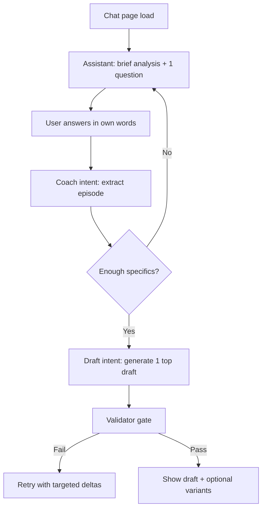
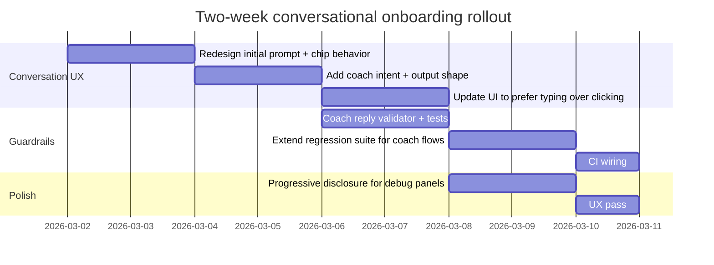

# Conversational onboarding redesign for Strategy Chat

## Executive summary

Your generation quality has improved, but the *experience* still feels like a form: the UI asks the user to click categorical buttons (“Project Showcase”, “Operator Lessons”), then click “Turn Into Drafts”, and the model responds to those thin inputs with generic language. This is exactly the kind of UX that conversational design guidance warns against: too many options early can cause “decision friction” and reduce follow‑through, while good conversational systems use turn‑taking and ask *one* focused question at a time. citeturn7search0turn7search1turn5search0

What to change (high level):

- Replace “pick a lane” and “pick an angle” as *required* steps with a short coaching flow: the assistant should ask one concrete question that extracts a story/event, then draft. This aligns with turn‑taking and reduces choice overload. citeturn7search0turn7search1turn5search0  
- Make suggestions optional (chips) rather than mandatory (buttons that gate generation), and progressively disclose advanced/debug panels instead of rendering them inline in the main assistant message. citeturn7search2turn6search0  
- Implement a dedicated “coach” intent (or equivalent conversation phase) so free‑text replies trigger *better questions* and *reasoned recommendations*, not immediate angle lists.

Enabled connector used for this audit: entity["company","GitHub","code hosting platform"] (repo: `ShernanJ/stanley-x-mvp`).

Key repo touchpoints that drive the current button-first behavior:

- UI chat flow and button rendering in `apps/web/app/chat/page.tsx`. fileciteturn68file0L1-L1  
- Server orchestration and “effectiveMessage” fallback logic in `apps/web/app/api/creator/chat/route.ts`. fileciteturn74file0L1-L1  
- Pipeline logic and intent handling in `apps/web/lib/onboarding/chatAgent.ts`. fileciteturn78file1L1-L1  
- Draft validation rules (CTA + 4-section enforcement) in `apps/web/lib/onboarding/draftValidator.ts`. fileciteturn78file0L1-L1  
- Regression harness you can extend to prevent “UI feels like a form” regressions in `apps/web/lib/onboarding/regression.ts`. fileciteturn74file4L1-L1  

## Repo audit findings tied to the current UX

The UI rendering you shared matches a deterministic “wizard” pattern:

- Assistant asks: “tell me in your own words, or pick a lane to start.”
- UI renders lane chips.
- After selection, assistant renders Angle cards with “Turn Into Drafts”.
- After angle selection, UI renders Draft cards with “Edit”.

In the repo, this is consistent with the chat screen being responsible for:

- Manufacturing the *first* assistant prompt + quick replies on the client (`page.tsx`). fileciteturn68file0L1-L1  
- Sending thin “selection-only” payloads to the server, where the server constructs a fallback `effectiveMessage` when the user did not type anything. fileciteturn74file0L1-L1  

That fallback is a major source of genericness: when the user clicks “Operator Lessons”, the model is often effectively prompted with just `"Operator Lessons"` (or equivalently thin text), which strongly encourages broad, abstract advice.

Separately, the repo already contains a clear product philosophy: “UI never owns logic.” (From the project README.) fileciteturn80file0L1-L1  
Right now, the UX is inadvertently *forcing logic into UI* by using UI chips to gate progress and generate prompts.

## Why the current UX still feels “button-driven” instead of conversational

There are three interacting problems: choice overload, turn-taking violations, and missing “wide-to-narrow” questioning.

### Choice overload and early commitment

Your current onboarding asks users to commit to categories (lane, then angle) before the system has gathered any concrete material. Research on “choice overload” shows that larger option sets can reduce commitment/action even when they increase initial engagement. citeturn5search0  
You are essentially doing “24 jams first” (lots of early choices), instead of “6 jams then purchase” (limited, guided choices). citeturn5search0

### Turn-taking and “don’t keep speaking after asking”

Your assistant outputs large blocks of meta (“why this works”, “watch out for”, blueprint text) and then asks the user to choose. That violates a core turn-taking principle: if you ask a question, stop and hand the mic back to the user. citeturn7search0turn7search1

### Missing wide-to-narrow question design

Good conversational systems start with a wide-focus question (“tell me what you want in your own words”), and only narrow down with suggestions if the user gets stuck. citeturn7search1turn7search2  
Your UI does the opposite: it immediately narrows into a taxonomy (lanes, then angles), so most users never say anything specific—so the model never gets the story details it needs.

### Progressive disclosure is being applied in the wrong place

Progressive disclosure improves usability by keeping the primary UI simple and moving advanced detail to secondary surfaces. citeturn6search0  
You already have a “View Analysis” affordance in your UI; but the experience still surfaces many “analysis/debug” artifacts inline, creating a “dashboard-in-chat” feeling rather than a coach feeling.

## Proposed conversational onboarding contract that matches the Stanley feel

This redesign keeps your existing pipeline (planner/writer/critic + strict draft validator) but changes the *conversation contract* so the user is guided by questions and the model provides reasoned recommendations, not menus.

### Coaching phases

Use a lightweight phase model. The key is: **don’t ask the user to choose an angle until you have a story/event.**

**Phase: orient**
- Assistant summarizes the analysis briefly (2–4 lines max).
- Assistant makes one recommendation (“I’d start with Operator Lessons because …”).
- Assistant asks one concrete question to extract material (one “episode”).

**Phase: extract**
- Assistant asks one follow-up question to make the episode usable:
  - “What changed after you did X?”
  - “What did you try first that failed?”
  - “What’s the constraint?”

**Phase: draft**
- Assistant drafts immediately (one top draft), then offers *optional* alternatives and CTA variants.

This matches the guidance to ask a single question, then stop, while using suggestions as hints rather than requirements. citeturn7search0turn7search2

### Suggestions should be optional, short, and few

Use chips as optional suggestions, but keep them to 2–3 and don’t require clicking. The assistant message should be answerable by typing. citeturn7search2turn7search1

### “Reasoned recommendation” rule to reduce decision burden

Whenever you present options, include:
- “Here’s what I recommend and why…”
- “If you prefer X, pick option B…”

That reduces the “decide hard” feeling and makes the assistant feel like a partner.

## Prompt contract updates to support conversational questioning and strict drafts

The core change: separate the “coach” prompting from the “draft writer” prompting.

### Coach contract (system + user)

**System message (coach mode)**
- Role: growth partner + writing coach (human tone).
- Rules:
  - Ask exactly one question at the end of your message.
  - Do not present more than 3 options at once.
  - If the user input is a taxonomy label (“Operator Lessons”) or otherwise thin, ask for a concrete episode.
  - Provide a recommendation with 1–2 sentence reasoning.
  - Do not output angle cards; do not output drafts.
  - Keep message under ~120 words unless user requested depth.

This is directly aligned with turn-taking and question design guidance (“prompt with only a single question at a time”). citeturn7search0turn7search1

**User message (coach mode payload template)**
Include structured context you already have, but keep it compact:
- archetype + niche + loop
- a *single* best-performing anchor summary (NOT the full anchor text)
- known constraints (tone casing/risk)
- current goal (“followers/leads/authority”)

### Draft writer contract (strict 4-section format + CTA)

You already have a strict validator. The missing piece is making the writer prompt explicitly optimize for “passes validator” and “reads human”.

Add these writer rules:

- Output must be **exactly four sections**, separated by a **single blank line**.
- Section headers are literal labels (no markdown):
  - `THESIS:`
  - `PROOF:` (bullets)
  - `MECHANISM:` (numbered)
  - `CTA:` (single final line)
- The final line must be a CTA the validator recognizes (don’t invent new CTA shapes). fileciteturn78file0L1-L1
- Ban “template voice”: avoid “Small teams can…” and “The key is…” unless user explicitly asked for generic.

### CTA options table for lane/goal fit

Keep CTA variants to A/B/C and select based on lane + goal.

| CTA option | Exact end-line pattern (example) | Best for goal | Best for lane | Why it fits |
|---|---|---|---|---|
| A: “Follow sprint” | `CTA: Follow — I’m posting operator lessons for the next 14 days.` | Followers | Original / Standalone | Clear expectation + series framing improves returns |
| B: “Reply keyword” | `CTA: Reply "OPS" and I’ll send the checklist.` | Leads + followers | Original / Standalone | Converts comments into engagement + light capture |
| C: “Question CTA” | `CTA: What’s the smallest team you’ve seen outperform a bigger one?` | Conversation | Original / Standalone | Matches conversation loop when your readiness supports it |

(Your current drafts often fail because they end with “Follow me for more insights…” which is plausibly human but doesn’t match the strict validator patterns.) fileciteturn78file0L1-L1

## Implementation plan for the repo

### UI changes that remove “mandatory clicking”

Primary file: `apps/web/app/chat/page.tsx`. fileciteturn68file0L1-L1  

Change the UI contract so chips are *suggestions*, not required steps:

- Replace the initial “pick a lane” chip set with:
  - one short assistant message
  - one open-ended question
  - up to three example replies (chips)
- Remove the “Angle cards → Turn Into Drafts” gating step in the default path:
  - Either: auto-generate **one** draft after the extract phase
  - Or: present angles as a numbered list and let the user reply “1/2/3” (typed), not click

This aligns with the “Suggestions” guidance: chips should help answer a question, not replace the conversation. citeturn7search2

### Backend changes that stop “Operator Lessons → generic advice”

Primary file: `apps/web/app/api/creator/chat/route.ts`. fileciteturn74file0L1-L1  

Right now, your server constructs a fallback message when `userMessage` is empty. That’s what turns clicks into thin prompts.

Update the request handling so **every interaction** has a meaningful user message:

- If the user clicked a lane, send a “synthetic” user message like:
  - `"I want to focus on Operator Lessons. Help me find a specific story worth posting."`
- If the user clicked an angle, send:
  - `"Use Angle 2. Ask me one question to make it specific before drafting."`

Then add a new intent to the API:
- `intent: "coach"` (or `intent: "onboard"`) that always returns a single follow-up question and no drafts.

### Agent changes that enforce the new conversational behavior

Primary file: `apps/web/lib/onboarding/chatAgent.ts`. fileciteturn78file1L1-L1  

Add:

- A new output shape: `"coach_question"`
- A new intent: `"coach"`
- A deterministic guardrail: if the user message is too short / is just a category label, route to coach_question even if intent was “ideate”.

This also supports the “wide- to narrow-focus questions” approach: you can start broad, and only narrow if the user needs help. citeturn7search1

### TypeScript-friendly pseudocode for routing and validation

```ts
type ChatIntent = "coach" | "ideate" | "draft" | "review";
type OutputShape =
  | "coach_question"
  | "ideation_angles"
  | "short_form_post"
  | "long_form_post"
  | "thread_seed"
  | "reply_candidate"
  | "quote_candidate";

function resolveNextStep(ctx: {
  intent: ChatIntent;
  userMessage: string;
  contentFocus?: string | null;
  history: Array<{ role: "user" | "assistant"; content: string }>;
}): { intent: ChatIntent; shape: OutputShape } {
  const msg = ctx.userMessage.trim();

  const isThin =
    msg.length < 18 ||
    msg.toLowerCase() === "operator lessons" ||
    msg.toLowerCase() === "build in public";

  // If user hasn’t provided an “episode”, don’t ideate; ask.
  if (ctx.intent !== "draft" && isThin) {
    return { intent: "coach", shape: "coach_question" };
  }

  // If user explicitly asked for drafting, draft.
  if (/draft|write|turn (this|it) into/i.test(msg)) {
    return { intent: "draft", shape: "long_form_post" };
  }

  // Otherwise continue coaching until enough detail exists.
  return { intent: "coach", shape: "coach_question" };
}

function validateCoachReply(reply: string): string[] {
  const errors: string[] = [];
  const questionMarks = (reply.match(/\?/g) ?? []).length;
  if (questionMarks !== 1) errors.push("E_COACH_ONE_QUESTION");
  if (reply.length > 900) errors.push("E_COACH_TOO_LONG");
  return errors;
}
```

### Testing and CI

You already have a regression harness in `apps/web/lib/onboarding/regression.ts`. fileciteturn74file4L1-L1  

Extend it with a new check type to prevent backsliding:

- For `intent:"coach"` prompts:
  - assert outputShape = `coach_question`
  - assert no `angles` array is returned
  - assert reply ends with exactly one question mark
- For “draft” prompts:
  - keep your strict validator constraints (4 sections, CTA validity, n-gram overlap, word range). fileciteturn78file0L1-L1  

CI suggestion:
- Add a lightweight GitHub Actions job that runs:
  - unit tests for validator
  - regression suite for at least one account fixture in a “mock onboarding run” mode

## Diagrams for the redesigned flow and a two-week rollout

### Pipeline flow



### Two-week rollout timeline



## A detailed Codex prompt to implement the rework

Copy/paste the following into Codex as your implementation task.

```text
You are working inside the repo ShernanJ/stanley-x-mvp.

Goal: Make the chat onboarding feel like a human writing coach (Stanley-like), not a button-driven wizard.
Constraints:
- Chips/buttons must be OPTIONAL suggestions, not required gating steps.
- The assistant must ask ONE focused question at the end of each coach message (turn-taking).
- Do not dump debug/blueprint text inline in the main assistant reply; keep it behind “View Analysis” or a collapsible region.
- Preserve the strict draft validator for long-form posts (exact 4 sections + CTA rules).

Files to read first:
- apps/web/app/chat/page.tsx
- apps/web/app/api/creator/chat/route.ts
- apps/web/lib/onboarding/chatAgent.ts
- apps/web/lib/onboarding/draftValidator.ts
- apps/web/lib/onboarding/regression.ts

Implement:
1) Add a new intent and shape
- Extend CreatorChatIntent to include "coach".
- Add a new outputShape "coach_question".
- Update any unions/switch statements and types that assume only ideate/draft/review.

2) UI: remove mandatory lane + angle clicking
- In apps/web/app/chat/page.tsx:
  - Replace the initial assistant message that renders contentFocusOptions chips with:
    - a brief analysis summary (2–4 lines),
    - a reasoned recommendation (1–2 sentences),
    - ONE question asking for a concrete episode (“Tell me the most recent situation where X happened…”).
  - Keep at most 3 quick reply chips as examples of answers (e.g., “I shipped ___”, “I failed at ___”, “A user surprised me by ___”).
  - Ensure the user can type instead; chips just fill the input and submit.

- Remove the “Angle cards -> Turn Into Drafts” gating path as the default:
  - If intent is coach: do not render angles or draft cards.
  - Only render drafts after draft intent.

3) Server route: stop using thin effectiveMessage from clicks
- In apps/web/app/api/creator/chat/route.ts:
  - Ensure every request that arrives without userMessage gets a synthetic userMessage that is actionable, e.g.
    - “I picked Operator Lessons. Ask me ONE question to make this specific before drafting.”
  - Add support for intent "coach".

4) chatAgent: implement coach behavior
- In apps/web/lib/onboarding/chatAgent.ts:
  - When intent === "coach":
    - Output only: reply (short), no angles, no drafts.
    - reply must end with exactly one question mark.
    - include 1 recommendation sentence (why this question matters).
  - Add a guard: if userMessage is short or equals a taxonomy label (e.g., “operator lessons”), override intent to coach.

5) Tests / regression
- Extend apps/web/lib/onboarding/regression.ts:
  - Add a regression check for coach that asserts:
    - outputShape === "coach_question"
    - drafts list is empty
    - reply contains exactly one question mark
- Add a small unit test module for coach reply validation logic.

Acceptance criteria:
- On first load, user is NOT forced to click a lane; they can just answer the coach question.
- The assistant asks one question at a time and stops.
- A user can get to a valid long-form draft by typing answers (no required buttons).
- Long-form drafts still must pass the strict validator: 4 sections + valid CTA.
```

## Assumptions

- The chat experience is intended to remain a Next.js App Router page with server routes, and you prefer keeping the “backend owns logic” boundary described in the repo README. fileciteturn80file0L1-L1  
- You want to preserve your strict draft validator behavior (including CTA strictness) rather than loosening it to accept more natural-but-variable CTA phrasings. fileciteturn78file0L1-L1  
- “Stanley-like” UX means: short analysis, turn-taking, one question at a time, and optional suggestions (chips) rather than forced menus—consistent with mainstream conversational design guidance. citeturn7search0turn7search2turn7search1