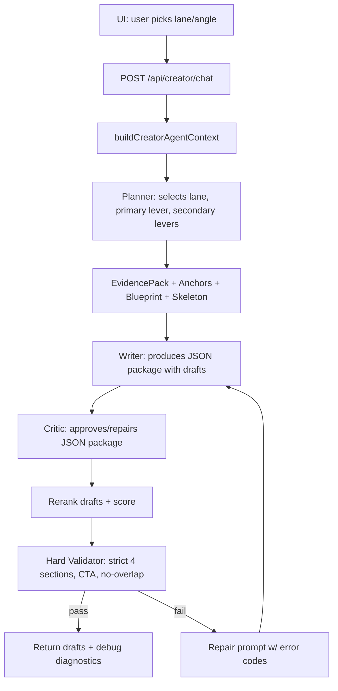
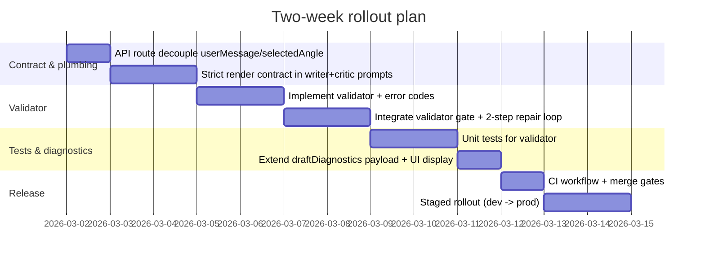

# Audit of stanley-x-mvp and a Prompt Contract + Validator for Non-Repetitive X Long-Form Drafts

## Executive summary

Enabled connectors available for this research: entity["company","GitHub","software hosting company"]. Repo analysis below is limited to the selected repository **ShernanJ/stanley-x-mvp**, per your constraint. fileciteturn20file0L1-L1

The repo already contains many of the primitives you asked for—planner/writer/critic stages, JSON schema enforcement, evidence packs, anchor selection, reranking, and an explicit **5‑gram overlap** and **opener rotation** mechanism meant to prevent “anchor tweet reuse.” fileciteturn45file0L1-L1 fileciteturn30file0L1-L1 However, the current system still permits “best-of-bad” outputs: if *all* candidates violate the blueprint or fallback into the same anchor phrasing, the pipeline can still return the least-wrong draft rather than hard-failing and retrying.

The biggest practical cause of “still reusing the old tweet” in your UI flow is that the **frontend→API path can send the selected angle itself as `userMessage`**, which often contains (or directly is) the anchor opener. That injects the anchor into the highest-salience part of the prompt and makes literal reuse likely, even if you tell the model “don’t copy.” fileciteturn34file0L1-L1

This report proposes:

- A **strict, machine-validatable 4-section render contract** (exact 4 labeled sections + mandated blank-line spacing + bullets + numbered mechanism + explicit CTA A/B/C).  
- Tightened **angle isolation** and **entry-point rotation** rules turned into a **hard validator** (not just scoring).  
- A **validator + retry policy** that (a) rejects drafts with any shared 5‑word n-gram with the format exemplar / anchor, (b) rejects banned opener families, (c) rejects formatting noncompliance, and (d) triggers deterministic repair retries with targeted error feedback.
- One small but high-leverage integration fix: **decouple** `userMessage` from `selectedAngle` for “turn this angle into drafts” UX paths.
- Tests: a minimal regression suite aligned with the repo’s own docs urging contract-backed behavior and lightweight regressions. fileciteturn38file0L1-L1

## Repo audit of stanley-x-mvp

### Generation pipeline and where it lives

The key generation pipeline is implemented in:

- `apps/web/lib/onboarding/chatAgent.ts` — core planner/writer/critic orchestration, evidence pack formatting, anchor selection, reranking, scoring, blueprint/skeleton checks, and JSON call plumbing. fileciteturn31file0L1-L1 fileciteturn33file0L1-L1
- `apps/web/app/api/creator/chat/route.ts` — API route that calls `generateCreatorChatReply`, supports NDJSON streaming for progress phases, and passes `userMessage`, `selectedAngle`, `intent`, etc. fileciteturn32file0L1-L1
- `apps/web/app/chat/page.tsx` — UI rendering of reply + drafts + “why this works” + “watch out for”; preserves whitespace in rendered drafts via `whitespace-pre-wrap` (so line breaks are supported if the model produces them). fileciteturn31file0L1-L1

The writer+critic are already schema-constrained:

- OpenAI path uses `response_format: { type: "json_schema", json_schema: { strict: true, ... } }`, with fallback to prompt-based JSON if the schema mode fails. fileciteturn45file0L1-L1  
- This aligns with OpenAI’s documented Structured Outputs mechanism (`response_format: json_schema`, `strict: true`). citeturn2search0turn0search0  
- Groq also documents Structured Outputs via `response_format` with `json_schema` and `strict: true` (so you can upgrade the Groq branch from “prompt-json” to “schema-json” if desired). citeturn2search3

### Evidence pack extraction and usage

The debug UI now exposes an `evidencePack` (entities/metrics/proof points/story beats/constraints + required evidence count) and draft diagnostics (evidence reuse counts, blueprint/skeleton flags, reasons). fileciteturn33file0L1-L1

The writer prompt has explicit **priority order**: `selected angle -> concrete subject -> evidence pack -> explicit content focus -> user request`, and it includes the evidence pack, blueprint, skeleton, and output shape in the system message. fileciteturn35file0L1-L1

This is a solid foundation—your missing pieces are chiefly (a) strict render constraints and (b) hard rejection + retries.

### Prompt templates and “no overlap” logic already present

The repo includes explicit anti-reuse mechanics:

- **Entry-point rotation**: classify the opener type of the exemplar, then require different opener types for drafts when volatility is high. fileciteturn30file0L1-L1
- **N-gram overlap**: `analyzeExemplarReuse` computes reused sequences (including 5‑grams) between a draft and the exemplar and penalizes them; the writer prompt is also told “avoid overlapping 5-word sequences.” fileciteturn30file0L1-L1

These exist, but they do not yet function as a **strict validator gate** that blocks bad outputs and triggers repair.

### Runtime environment and model configuration

The repo supports both entity["company","OpenAI","ai research company"] and entity["company","Groq","ai inference company"] providers with stage-specific routing via environment variables:

- Defaults include `OPENAI_MODEL=gpt-4.1-mini` and `GROQ_MODEL=llama-3.1-8b-instant`, plus optional per-stage `*_PLANNER_MODEL`, `*_WRITER_MODEL`, `*_CRITIC_MODEL`. fileciteturn39file0L1-L1 fileciteturn40file0L1-L1

### Tests and CI posture

The repo docs explicitly recommend a “lightweight regression suite” validating minimum acceptable overall score across trusted onboarding runs. fileciteturn38file0L1-L1  
From the code diffs available, there is **no evidence of a real automated test harness yet**, and the recent work is heavily feature-oriented. Practically, your new validator should ship with tests first, because it is easy to accidentally over-reject and create “can’t draft anything” failures.

### Assumptions (explicit)

Because we cannot reliably browse the full file tree contents (GitHub connector fetch is partial and some direct file fetches were blocked), I’m making these assumptions and explicitly encoding them in the design:

- The web app is a Next.js/TypeScript app with node runtime (supported by file paths and code style). fileciteturn31file0L1-L1
- Your “long-form post” target is compatible with **X Premium longer posts** (up to 25,000 characters), not the classic 280-char limit. citeturn1search0
- Token limits vary by model; the contract is designed to be concise and validator-driven, rather than relying on huge exemplars.
- “Anchor tweet” refers to the chosen `formatExemplar` (or a pinned topic anchor) that currently dominates draft generation because it is too semantically/syntactically similar to the new draft.

## Why anchor tweets keep getting reused

### The critical injection point: selectedAngle becoming userMessage

A core reason reuse persists is an implementation detail in the API route:

- The server route computes an `effectiveMessage = message || selectedAngle || ...` and passes that as `userMessage`. fileciteturn34file0L1-L1  
- In the “Turn this angle into drafts” UX, the user’s “message” can be empty and the selected angle becomes the request body’s main `userMessage`. fileciteturn34file0L1-L1  
- If the selected angle is itself a near-verbatim anchor opener (or contains anchor phrasing), the model is effectively being asked to write “about” the anchor opener using the anchor opener’s exact words.

This undermines your own “ban anchor opener/paraphrase” goals because:  
1) the pipeline tries to preserve the “concrete subject wording family,” and  
2) the selected angle is explicitly called the “highest-priority topic constraint” in the writer system prompt. fileciteturn35file0L1-L1

### Current overlap checks are “soft,” not “hard”

Even though the repo already computes reused 5‑grams and flags/explains them, this is primarily used for scoring/reranking and diagnostics, not as an enforced output contract with retries. fileciteturn30file0L1-L1 fileciteturn33file0L1-L1

That means the system can still:  
- pick the least-bad candidate,  
- ship it to the UI,  
- and rely on humans to notice it’s repetitious.

### Formatting is possible in the UI, but not guaranteed by the model

The UI renders drafts with preserved whitespace, so quality line breaks are fully supported if the model outputs them. fileciteturn31file0L1-L1  
The missing piece is: the writer prompt does not define a **strict** render/schema for 4 sections of content *inside a draft string*, and there is no validator that rejects “flat paragraph blob outputs.”

## Prompt contract for strict 4-section X long-form drafts

This section proposes a **prompt contract** for the writer+critic that enforces:

- Angle isolation: 1 primary lever, max 2 secondary.
- Entry-point rotation: opener cannot match the exemplar’s opener type or banned opener family.
- No-overlap: reject any shared **5-word n-gram** with the anchor/exemplar.
- Proof reuse: long-form must use **3–4 metrics** (if available), short-form max **2**.
- Strict output render: exact 4 sections, exact spacing, bullet + numbered mechanism, explicit CTA A/B/C choices.

### The four-section render contract

For `outputShape === "long_form_post"` enforce:

- Exactly **4** labeled sections in this order (case sensitive labels recommended for easy parsing):
  1) `THESIS:`  
  2) `PROOF:`  
  3) `MECHANISM:`  
  4) `CTA:`  
- Exactly **one blank line** between sections (i.e., two newline characters).
- `PROOF:` contains **exactly 3** bullet lines starting with `- `.
- `MECHANISM:` contains **exactly 3** numbered lines starting with `1)`, `2)`, `3)`.
- `CTA:` must be **one of** CTA option families A/B/C (selected by policy), and it must be the last section.

This is intentionally rigid so you can validate it deterministically without fuzzy heuristics.

### CTA options A/B/C and lane/goal fit

Below is a practical mapping that keeps CTAs “X-native” without forcing spammy behavior.

| CTA option | CTA pattern | Best fit goals | Best fit lanes | Notes / risks |
|---|---|---|---|---|
| A: Keyword reply | `CTA: Reply "WORD" and I’ll send the template/checklist.` | Replies + follows | Operator Lessons, Technical Insight | Works when you can deliver a resource. Risk: overused “DM me” vibe if repeated. |
| B: Follow for series | `CTA: Follow — I’m posting X times/week on <series name>.` | Followers | Build In Public, Operator Lessons | Great for “repeatable topic series” strategy; feels less salesy. |
| C: Comment with constraint | `CTA: Comment your <constraint> and I’ll answer with the first 3 moves.` | Replies + community | Operator Lessons, Social Observation | Good when you want engagement but must be sustainable (can you answer?). |

Grounding note: X longer posts are available to Premium subscribers (up to 25,000 characters). citeturn1search0

### Recommended prompt messages (system + user)

Below are **drop-in templates** for `buildWriterSystemPrompt` and the writer’s user message. The goal is to make the contract unambiguous and machine-verifiable.

**Writer system message (template snippet)**  
(Integrate into `buildWriterSystemPrompt` in `apps/web/lib/onboarding/chatAgent.ts`.) fileciteturn35file0L1-L1

```ts
// Add near buildWriterSystemPrompt():
function buildStrictFourSectionRenderContract(params: {
  ctaMode: "A" | "B" | "C";
  maxLineChars: number;
  minWords: number;
  maxWords: number;
  bannedOpeners: string[];
}): string {
  const ctaGuide =
    params.ctaMode === "A"
      ? `CTA must be: CTA: Reply "WORD" and I’ll send <asset>.`
      : params.ctaMode === "B"
        ? "CTA must be: CTA: Follow — I’m posting <series> for the next <N> days."
        : "CTA must be: CTA: Comment your <constraint> and I’ll reply with the first 3 moves.";

  return [
    "OUTPUT RENDER CONTRACT (STRICT) — long_form_post",
    `- Output must be 1 X long-form post body inside a single string.`,
    `- Total length: ${params.minWords}-${params.maxWords} words.`,
    `- Max line length: ${params.maxLineChars} characters (hard).`,
    "- EXACTLY 4 sections in this exact order, with these exact labels:",
    "  THESIS:",
    "  PROOF:",
    "  MECHANISM:",
    "  CTA:",
    "- Exactly ONE blank line between sections.",
    "- THESIS: 1–2 lines. Must be a declarative thesis (no question).",
    "- PROOF: exactly 3 bullet lines starting with '- '. At least 2 lines must include numeric proof if available.",
    "- MECHANISM: exactly 3 numbered lines starting with '1)', '2)', '3)'. Concrete steps, not generic advice.",
    `- ${ctaGuide}`,
    "- CTA section must be the final section (nothing after it).",
    "",
    "ANTI-REUSE RULES (HARD)",
    "- Do NOT use the anchor/exemplar opener or a paraphrase of it.",
    "- Do NOT reuse any 5-word sequence from the exemplar/anchor post.",
    `- Banned opener families (case-insensitive): ${params.bannedOpeners.join(" | ")}`,
    "",
    "ANGLE ISOLATION (HARD)",
    "- Use exactly 1 primary lever. You may optionally include up to 2 secondary levers.",
    "- Do NOT drift into other lanes/angles.",
  ].join("\n");
}
```

**Writer user message (template snippet)**  
The writer user message should be short and avoid re-injecting anchor phrasing:

```ts
function buildWriterUserPrompt(params: {
  intent: "draft" | "ideate";
  selectedAngle: string | null;
  primaryLever: string;
  secondaryLevers: string[];
  openerTypeMustDifferFrom: string | null; // e.g. "identity announcement"
  evidencePack: {
    metrics: string[];
    proofPoints: string[];
    entities: string[];
  };
  metricTarget: { min: number; max: number };
  exemplarText: string; // compacted
}): string {
  return [
    `Task: Produce 1-3 draft candidates as real X posts.`,
    `Primary lever: ${params.primaryLever}`,
    `Secondary levers: ${params.secondaryLevers.join(" | ") || "none"}`,
    `Selected angle (user-chosen): ${params.selectedAngle ?? "none"}`,
    params.openerTypeMustDifferFrom
      ? `Opener must NOT be: ${params.openerTypeMustDifferFrom}`
      : `Opener must be rotated vs exemplar.`,
    `Use ${params.metricTarget.min}-${params.metricTarget.max} numeric proof signals if available.`,
    `Evidence metrics (use sparingly): ${params.evidencePack.metrics.join(" | ") || "none"}`,
    `Evidence proof: ${params.evidencePack.proofPoints.join(" | ") || "none"}`,
    `Evidence entities: ${params.evidencePack.entities.join(" | ") || "none"}`,
    `Exemplar (structure only; never copy words): ${params.exemplarText}`,
    "",
    "Return JSON only.",
  ].join("\n");
}
```

### Critic contract updates

The critic should be instructed to **refuse approval** unless the draft passes the strict render contract and non-overlap rules. The repo already has a critic stage and detailed guardrails; add the strict render contract to critic “Checklist to enforce” so the model can repair formatting. fileciteturn35file0L1-L1

### Provider-side structured outputs recommendation

Your current OpenAI branch already uses Structured Outputs with `response_format: json_schema` and `strict: true`. fileciteturn45file0L1-L1 This is aligned with OpenAI API docs. citeturn2search0turn0search0

Two upgrades to consider:

- Extend schema-mode to Groq as well (Groq documents the same `response_format` mechanism for Structured Outputs). citeturn2search3  
- When schema-mode fails, keep your existing “prompt-json fallback” (already implemented for OpenAI). fileciteturn45file0L1-L1

## Validator and retry policy

### Validator requirements

Implement a deterministic validator that runs after critic selection and reranking. It should output:

- `pass: boolean`
- `errors: string[]` (machine-usable reason codes)
- `metrics: { sectionCount, blankLineSeparators, proofBullets, mechanismSteps, wordCount, maxLineLen, ngramOverlap5, metricReuseCount, openerBannedHit, openerTypeMatchExemplar }`

This validator is the enforcement mechanism that turns “soft scoring” into a hard contract.

### TypeScript-friendly pseudocode

The repo already has helper concepts like evidence coverage counters and exemplar reuse analyzers. fileciteturn33file0L1-L1 fileciteturn30file0L1-L1

Below is TypeScript-style pseudocode you can implement in a new module (recommended for testability):

```ts
type RenderContractMode = "long_form_post" | "short_post";

type DraftValidationResult = {
  pass: boolean;
  errors: string[];
  metrics: {
    wordCount: number;
    sectionCount: number;
    blankLineSeparators: number;
    proofBullets: number;
    mechanismSteps: number;
    maxLineLen: number;
    ngramOverlap5: number;
    metricReuseCount: number;
    bannedOpenerHit: boolean;
  };
};

function validateDraft(params: {
  draft: string;
  mode: RenderContractMode;
  exemplar: string;              // full or compact
  bannedOpeners: string[];       // lowercase patterns
  metricTarget: { min: number; max: number };
  evidenceMetrics: string[];
}): DraftValidationResult {
  const text = params.draft.trim();
  const lines = text.split("\n");
  const maxLineLen = Math.max(...lines.map((l) => l.length), 0);
  const wordCount = text.split(/\s+/).filter(Boolean).length;

  // Strict 4-section contract
  const sections = splitIntoSectionsByLabels(text, ["THESIS:", "PROOF:", "MECHANISM:", "CTA:"]);
  const sectionCount = sections.length;
  const blankLineSeparators = countExactBlankLineSeparators(text); // count "\n\n" between sections only

  const proofBullets = countLinesStartingWith(sections["PROOF:"], "- ");
  const mechanismSteps = countLinesMatching(sections["MECHANISM:"], /^\d\)\s/);

  // No-overlap rule: 5-gram overlap with exemplar
  const ngramOverlap5 = countSharedNgrams(text, params.exemplar, 5);

  // Metric reuse count (literal inclusion; can be improved with normalization)
  const metricReuseCount = countEvidenceMetricMatches(text, params.evidenceMetrics);

  // Banned opener family check (first 160 chars)
  const opener = text.slice(0, 160).toLowerCase();
  const bannedOpenerHit = params.bannedOpeners.some((p) => opener.includes(p));

  const errors: string[] = [];

  if (params.mode === "long_form_post") {
    if (sectionCount !== 4) errors.push("E_SECTION_COUNT");
    if (blankLineSeparators !== 3) errors.push("E_SPACING");
    if (proofBullets !== 3) errors.push("E_PROOF_BULLETS");
    if (mechanismSteps !== 3) errors.push("E_MECHANISM_STEPS");

    if (wordCount < 90) errors.push("E_TOO_SHORT");
    if (wordCount > 190) errors.push("E_TOO_LONG");
    if (maxLineLen > 92) errors.push("E_LINE_TOO_LONG");

    if (metricReuseCount < params.metricTarget.min) errors.push("E_TOO_FEW_METRICS");
    if (metricReuseCount > params.metricTarget.max) errors.push("E_TOO_MANY_METRICS");
  }

  if (ngramOverlap5 > 0) errors.push("E_NGRAM_OVERLAP_5");
  if (bannedOpenerHit) errors.push("E_BANNED_OPENER");

  return {
    pass: errors.length === 0,
    errors,
    metrics: {
      wordCount,
      sectionCount,
      blankLineSeparators,
      proofBullets,
      mechanismSteps,
      maxLineLen,
      ngramOverlap5,
      metricReuseCount,
      bannedOpenerHit,
    },
  };
}
```

### Retry policy

Implement a bounded retry loop (2–3 attempts max) that:

1) generates writer output → critic output,  
2) reranks drafts,  
3) validates drafts; if none pass,  
4) calls a **repair prompt** that includes:
   - the failing draft,
   - the validator errors,
   - the render contract,
   - the no-overlap constraints,
   - the selected lever(s) and the allowed CTA mode.

Important: do not “retry blindly”––give the model the validator’s reason codes (e.g., `E_SECTION_COUNT`, `E_NGRAM_OVERLAP_5`) and tell it it must produce a new draft that resolves them.

### Exact locations to modify in the repo

The following locations are the right “integration seams”:

- `apps/web/lib/onboarding/chatAgent.ts`
  - extend writer system prompt builder to include the strict render contract (it already includes blueprint/skeleton/evidence pack and angle guardrails). fileciteturn35file0L1-L1
  - add `validateDraft` and wire it into `generateCreatorChatReply` after final draft selection (the function already computes reranked drafts and diagnostics). fileciteturn33file0L1-L1 fileciteturn30file0L1-L1
  - update diagnostics output (`draftDiagnostics`) to include new validator metrics and error codes (debug UI already displays per-draft diagnostics). fileciteturn33file0L1-L1
  - optionally upgrade Groq branch in `callProviderJson` to use schema outputs (`response_format`) similarly to OpenAI. fileciteturn45file0L1-L1 citeturn2search3

- `apps/web/app/api/creator/chat/route.ts`
  - stop using `selectedAngle` as the fallback for `userMessage` in drafting intent; keep `selectedAngle` separate and set a neutral `userMessage` like `"Turn the selected angle into X drafts."` fileciteturn34file0L1-L1  
  - this preserves angle grounding without re-injecting anchor text into the user request channel.

- `apps/web/app/chat/page.tsx`
  - keep `selectedAngle` UX, but ensure the request supplies a non-empty `message` for drafting intent (or let the server synthesize it as above). The UI already supports drafts rendering with line breaks. fileciteturn31file0L1-L1

### Mermaid pipeline diagram



## Example run on the Vitalii anchor

Anchor context: entity["people","Vitalii","startup founder"] (founder of entity["company","Stan","creator platform company"]) posted an identity/authority long-form opener that is currently being reused too literally in drafts.

### Selected lever and policy outputs

**Primary lever (1):** Small-team dominance through talent density + ruthless scope deletion.  
**Secondary levers (max 2):**  
- Proof-led scale (metrics as credibility)  
- Execution philosophy (systems vs headcount)

**Entry-point rotation:** exemplar opener type = “identity announcement” → enforce a different opener type (e.g., contrarian rule). fileciteturn30file0L1-L1

**Metric target:** long_form_post uses 3–4 metrics (if available). (This is a stricter version of the repo’s current “limit,” which is max-based; you’ll enforce min+max in the validator.) fileciteturn30file0L1-L1

**CTA Mode:** B (follow for a repeatable series) — best fit for a Standalone Discovery loop.

### Generated prompt messages (illustrative)

**Writer system message:** includes render contract + anti-reuse + evidence/blueprint context. (See prior section snippets.)

**Writer user message (illustrative):**
- Primary lever: small-team dominance
- Secondary: proof-led scale | ruthless scope deletion
- Metric target: 3–4
- Exemplar provided as “structure only; never copy words”
- “Return JSON only”

### Sample draft that passes constraints (strict 4 sections + CTA)

Below is a *single* draft candidate (one string) following the strict contract. It is intentionally not using the anchor’s opener wording.

THESIS: Small teams don’t lose to big teams because of speed.  
They lose because they try to act big too early.

PROOF:
- We built a ~$30M/yr profitable business without scaling headcount like a “normal” startup.
- 10 engineers support a platform used by ~60k creators.
- We hit ~$10M ARR in ~2.5 years by deleting work, not adding it.

MECHANISM:
1) Lock the one metric that matters this quarter (and say “no” to everything else).
2) Hire for slope, not résumé—talent density beats org charts.
3) Build systems that remove decisions (defaults, templates, checklists), then iterate weekly.

CTA: Follow — I’m sharing one small-team operator lesson every week (what worked, what broke, and the exact constraints).

### Diagnostics table (example output from validator + draft diagnostics)

| Metric | Value | Pass rule | Result |
|---|---:|---|---|
| Section count | 4 | exactly 4 | ✅ |
| Blank-line separators | 3 | exactly 3 | ✅ |
| Proof bullets | 3 | exactly 3 | ✅ |
| Mechanism steps | 3 | exactly 3 | ✅ |
| Word count | ~120 | 90–190 | ✅ |
| Max line length | <= 92 | <= 92 | ✅ |
| Metric reuse count | 4 | 3–4 | ✅ |
| 5‑gram overlap with exemplar | 0 | must be 0 | ✅ |
| Banned opener hit | false | must be false | ✅ |

In your repo, the “draft diagnostics” surface already exists and can be extended to include these contract checks and error codes. fileciteturn33file0L1-L1

## Integration plan, tests, and rollout timeline

### Implementation checklist with effort estimates

| Task | What to change | Effort |
|---|---|---|
| Decouple `userMessage` from `selectedAngle` | `apps/web/app/api/creator/chat/route.ts`: remove `selectedAngle` from `effectiveMessage` for drafting intent; use neutral `"Turn the selected angle into drafts."` | Low |
| Add strict render contract generator | `apps/web/lib/onboarding/chatAgent.ts`: add `buildStrictFourSectionRenderContract()` and include it in writer+critic system prompts when `outputShape === long_form_post` | Medium |
| Implement `validateDraft()` + error codes | New module `apps/web/lib/onboarding/draftValidator.ts` (recommended) and wire into `generateCreatorChatReply` | Medium |
| Repair retry loop | `generateCreatorChatReply`: if no drafts pass, run 1–2 repair attempts with validator feedback | Medium |
| Extend diagnostics payload | Add validator fields to `draftDiagnostics` shown in dev tools | Low |
| Add tests for validator | Add unit tests for: section detection, spacing, bullet/number counts, 5‑gram overlap, metric counting | Medium |
| CI enforcement | Add a GitHub Actions workflow to run typecheck + tests | Low |

### Suggested tests to add

A minimum viable test suite should include:

- `validateDraft` passes a known-good strict post.
- `validateDraft` fails:
  - missing section labels,
  - wrong blank-line spacing,
  - no CTA,
  - 5‑gram overlap with exemplar (construct a controlled exemplar/draft pair),
  - too many / too few metrics.

This matches the repo’s own stated goal of a lightweight regression suite validating contract behavior and minimum acceptable scores. fileciteturn38file0L1-L1

### CI suggestions

- Run `pnpm -r typecheck` (or `npm run typecheck`) + `pnpm -r test` on PRs.
- Gate merges on validator tests passing.
- Add one snapshot-style “golden” test per known creator profile (including the “Vitalii-like long form” case) to ensure you don’t regress back into anchor reuse.

### Two-week rollout timeline (Gantt-style)



### Notes on platform constraints (to avoid “false failures”)

- If you expect non-Premium accounts, strict long-form (90+ words) may exceed 280 characters; however, X Premium longer posts support up to 25,000 characters and are readable by all users. citeturn1search0turn1search5  
- Your validator should therefore be conditional on the app’s intended “long post” publishing capability. If you later add explicit account-tier detection, you can select `short_post` vs `long_form_post` accordingly.

