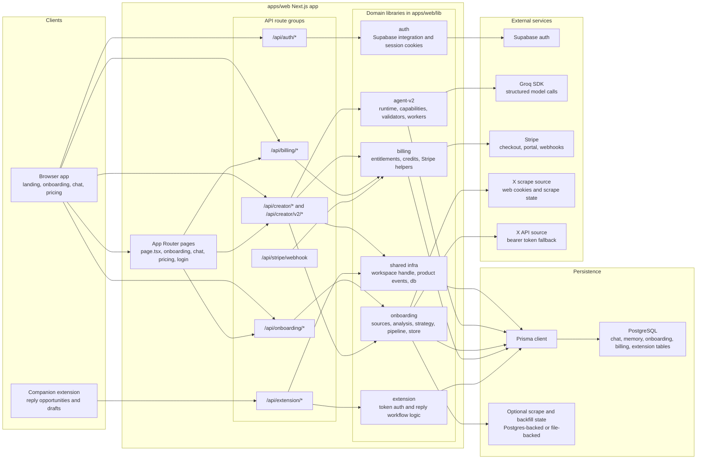
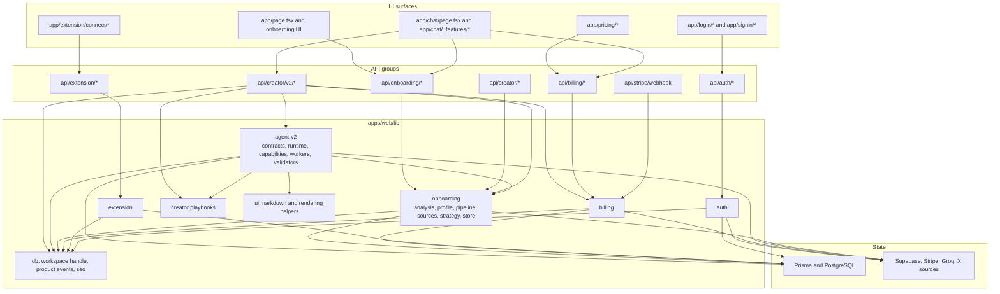
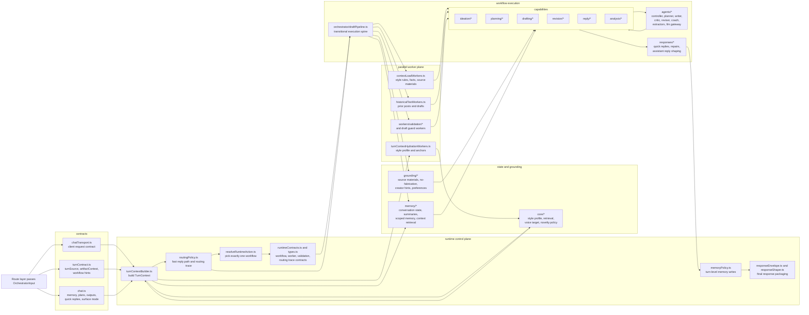
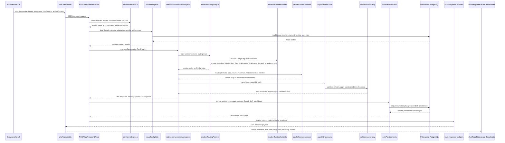
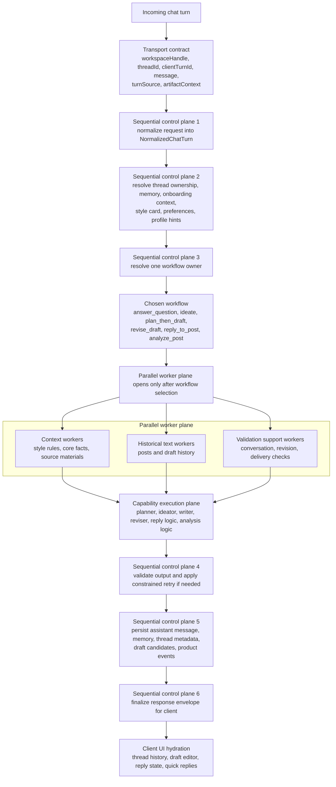
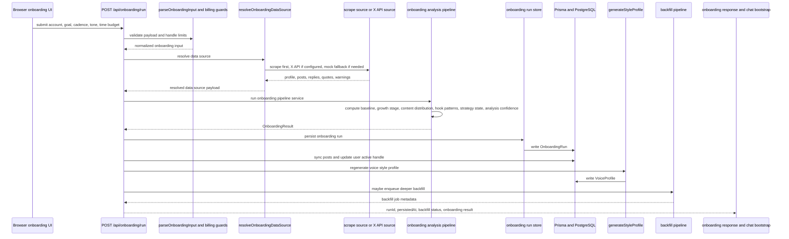

# App Diagrams

These diagrams describe the live implementation in `apps/web`, not the older planned monorepo shape.

If a diagram here disagrees with a migration note in `PLAN.md`, `Artifact.md`, or `LIVE_AGENT.md`, interpret this file as the current-state runtime map and the migration docs as target-state direction.

## 1. System And Infrastructure Diagram

What each section does:

- `Clients`: the browser UI and extension are the two entrypoints into the system.
- `apps/web Next.js app`: the single shipped application boundary for pages and API routes.
- `API route groups`: request-specific boundaries for auth, onboarding, creator workflows, billing, Stripe events, and extension traffic.
- `Domain libraries`: where the application logic actually lives today.
- `Persistence`: Prisma plus PostgreSQL hold the durable product state, while scrape/backfill state can be file- or DB-backed.
- `External services`: Supabase handles identity, Groq handles model calls, Stripe handles payments, and X sources feed onboarding data.

## 2. Application Module Map

What each section does:

- `UI surfaces`: page-level product entrypoints.
- `API groups`: route families that translate UI or extension requests into domain operations.
- `apps/web/lib`: the real application core, with most business logic concentrated inside the web package.
- `State`: durable internal state in PostgreSQL plus external system state from auth, billing, model, and X providers.

## 3. `lib/agent-v2` Internal Architecture

What each section does:

- `contracts`: defines the types that make UI turns and runtime semantics explicit.
- `runtime control plane`: owns turn assembly, workflow choice, trace generation, memory write patterns, and response packaging.
- `state and grounding`: provides durable conversation state, creator profile context, retrieval, and factual guardrails.
- `parallel worker plane`: runs read-only support tasks after a workflow has already been selected.
- `orchestrator/draftPipeline.ts`: still acts as the transitional execution spine that bridges runtime selection into actual capability execution.
- `capabilities`: the real workflow owners for ideation, planning, drafting, revision, reply, and analysis.
- `agents/*`: model-facing specialist workers, not peer routers competing for control.
- `responses/*`: deterministic shaping and repair before the route sends data back to the client.

## 4. AI Orchestration Sequence For /api/creator/v2/chat

What each section does:

- `chatTransport.ts`: turns client state into a structured transport request.
- `turnNormalization.ts`: gives raw UI input durable semantics before any runtime decision.
- `routePreflight.ts`: loads the state the runtime needs to make a good decision.
- `runtime/conversationManager.ts`: owns the turn-level orchestration and trace.
- `resolveRuntimeAction.ts`: chooses exactly one top-level workflow.
- `parallel context workers`: do read-only fan-out work such as extracting style rules or loading assets.
- `capability execution`: performs the actual answer, ideation, draft, revision, reply, or analysis path.
- `validators and retry`: enforce output quality before persistence.
- `routePersistence.ts`: writes durable state after the runtime result exists.
- `chatReplyState.ts and thread state`: convert the response into visible UI.

## 5. AI Agent Sequential Architecture

What each section does:

- `Transport contract`: preserves explicit UI intent instead of forcing the model to infer everything from free text.
- `Sequential control plane 1-3`: convert, enrich, and classify the turn before any expensive or ambiguous workflow execution.
- `Chosen workflow`: the runtime must have exactly one owner for the turn.
- `Parallel worker plane`: fan-out is allowed only for read-only support work after workflow selection.
- `Capability execution plane`: the specialist logic for drafting, revising, replies, analysis, or direct answers.
- `Sequential control plane 4-6`: quality gates, durable writes, and response shaping happen in a single ordered path.
- `Client UI hydration`: the browser turns the server result into visible product state.

## 6. Onboarding Sequence Diagram

What each section does:

- `POST /api/onboarding/run`: the request boundary for the main onboarding flow.
- `parseOnboardingInput and billing guards`: ensure the request is valid and allowed for the user’s plan.
- `resolveOnboardingDataSource`: decides whether the app should use scrape data, X API data, or mock fallback.
- `onboarding analysis pipeline`: turns raw posts and profile data into a growth model and strategy payload.
- `onboarding run store`: persists the canonical onboarding result for later chat grounding.
- `generateStyleProfile`: converts synced content into reusable voice/style memory for the AI runtime.
- `backfill pipeline`: optionally deepens the captured history after the initial onboarding result is returned.
