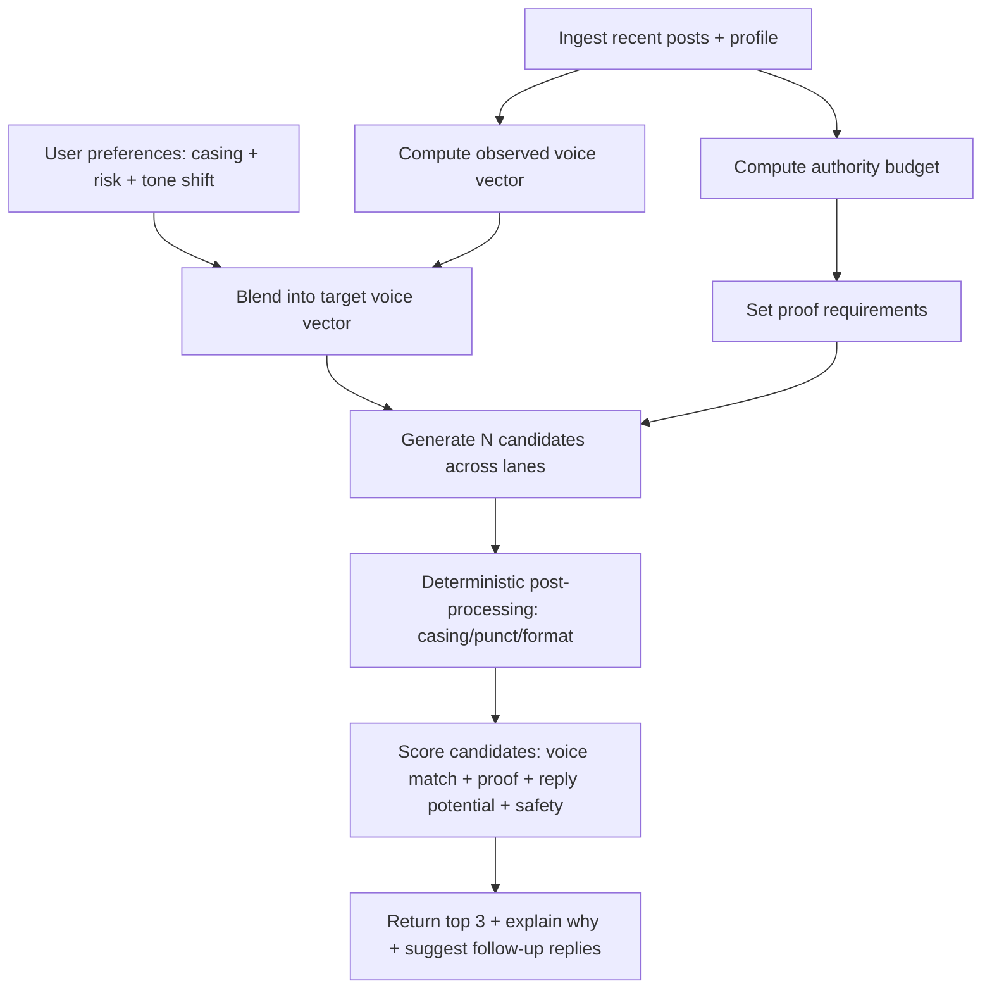

# Improving LLM Draft Posts for X

## Executive summary

Your repo already has the right *shape* for an X-native growth assistant (deterministic profile → constrained generation → critic). The quality gap you’re feeling—“over-optimizing for less casual accounts”—mostly comes from three concrete issues in the current implementation plus one strategic reality about X.

The highest-leverage fixes are:

Your app collects a **tone preference** (casing + risk) in `OnboardingInput`, but it is **not used** in either onboarding analysis or generation, so the model defaults to a “safe-neutral” register even when a user wants lowercase / loose. This makes the output skew “polished.”  

Your **lowercase detection is too strict** (it treats a post as “lowercase” only if *every* letter is lowercase). In tech writing, one “AI/API/OAuth” token breaks this and your voice model flips to “normal,” even if the writer is otherwise lowercase. That pushes the “voice anchors” and the drafts toward more formal styling.

On X, the feed ranking logic heavily rewards **replies and “reply engaged by author”** relative to likes, and heavily penalizes negative feedback. So the most useful drafts are the ones that (a) invite *real* replies and (b) are easy for you to follow up on without sounding fake. X’s open heavy-ranker writeup explicitly lists those engagement types and shows how they are combined via a weighted sum; it also documents that weights are adjustable and have been periodically tuned. citeturn10view0turn5view2

Finally, your “small account vs respected authority” intuition is correct: the same copy style does not work equally well at ~100 followers versus 6k+. For smaller accounts, you need *proof density* (projects, receipts, concrete observations) and *authenticity cues*; for higher-authority accounts, audiences tolerate broader claims with less immediate proof. Research in marketing and language consistently finds that **formality can reduce engagement** by undermining perceived authenticity, while more natural/informal language cues can increase engagement. citeturn4search6turn0search1

The rest of this report translates those insights into a specific “voice + authority budget” drafting system and concrete repo changes.

## What your repo is doing now and why drafts skew too formal

You’ve implemented a planner → writer → critic flow in `apps/web/lib/agent-v2/orchestrator/conversationManager.ts`, and you already push voice anchors and “do not sound corporate” constraints into the writer/critic prompts. That’s a strong foundation.

But the system currently behaves as if “voice = whatever the sample posts imply,” rather than “voice = (sample voice) blended with (user’s intended tone).” In practice:

Tone preference is captured but not propagated into generation. In your types, `OnboardingInput` includes `tone: { casing, risk }`, where casing is `lowercase|normal` and risk is `safe|bold`. However, `runOnboarding()` does not use `input.tone` at all, and `OnboardingResult` stores no tone fields—so the drafting pipeline never sees the toggle. This means the LLM only gets “voice hinting” from historical posts and your current chat message, not from the explicit “I want lowercase / bold” preference.

Lowercase detection is brittle for tech accounts. Your voice profile logic treats a post as lowercase only if `lettersOnly === lettersOnly.toLowerCase()`. This is extremely sensitive to one acronym or proper noun (“AI”, “OAuth”, “X”, “Stan”), so a user who “writes in lowercase” in the social sense can be classified as “normal.” That then affects:

- `primaryCasing`
- `lowercaseSharePercent`
- voice anchor selection (posts are scored partly by “postIsLowercase”)

So the retrieval context you feed the writer/critic can end up dominated by “polished” anchors even when the user’s intent is “cracked engineer lowercase.”

Temperature and model choice likely amplify generic tone. Your structured JSON generation uses a low temperature (0.2). Low temperature plus schema constraints tends to collapse outputs into safe, generic phrasing—especially on smaller models. Your default provider is entity["company","Groq","ai inference provider"] with a small fast model. That’s great for speed, but it increases the chance the writer can’t consistently hit “subtle authenticity cues” (like effortless lowercase minimalism) without additional deterministic shaping.

## What makes X harder than LinkedIn for LLM drafting

### The feed’s value system rewards conversation, not polish

X’s published engineering overview frames the home “For You” feed as a pipeline: candidate sourcing, ranking, then filtering. The ranking stage is driven by models estimating probabilities of engagement types, which are then combined into a score. citeturn5view2turn10view0

The open heavy-ranker README is unusually actionable for a growth app, because it lists the engagement types predicted (reply, good click, profile click, reply engaged by author, negative feedback, report) and explicitly states the final score is a **weighted sum of predicted engagement probabilities**, with weights that can change and have been periodically adjusted. citeturn10view0

Implication for drafting: text that “reads polished” but doesn’t invite replies is structurally misaligned with the feed’s strongest incentives. Conversely, a short, natural post that triggers replies and then gets follow-up replies from the author can be disproportionately valuable. citeturn10view0

### “Authenticity cues” matter more on X than “professional performance cues”

Your observation that LinkedIn rewards a more structured, performative professionalism is directionally consistent with how audiences behave on each platform, but the more important point for your app is: on X, audiences often interpret *over-polish* as “trying too hard,” and that can reduce replies.

Two relevant research threads support building “authentic-sounding” drafts:

A large-scale influencer study finds that more formal language can reduce engagement, while informal cues (netspeak, emojis) can enhance engagement—consistent with an authenticity mechanism. citeturn4search6

A multimethod study in the Journal of Consumer Research finds that sensory language increases engagement and willingness to buy by increasing perceived authenticity (people infer the influencer actually uses the product). While not X-specific, the mechanism maps: vivid, concrete details feel “lived,” which increases trust and engagement. citeturn0search1

For your “cracked engineer” case, that “authenticity channel” often looks like: lowercase, short lines, real build details, and proof (screenshots, metrics, constraints)—not polished “LinkedIn voice.”

### You must avoid spammy “engagement hacks” because policy risk is real

X’s authenticity/platform manipulation policy explicitly prohibits engagement spam and coordination schemes (trading engagement, coordinating to inflate metrics, indiscriminate automation). Your app should steer users toward *genuine conversational prompts*, not “like/comment for…” mechanics that resemble metric inflation. citeturn2search3

## A better drafting system: voice target + authority budget

Your product will improve fastest if you treat drafting as a **controlled transformation problem**, not “generate a good tweet.”

### Key concept: split “observed voice” and “target voice”

Right now you infer voice from the sample, then instruct the writer to match it. That’s correct for “preserve mode,” but wrong for users who explicitly want a shift (e.g., “I should be lowercase and project-heavy”).

Define:

Observed voice vector (from ingestion): casing %, average length band, line breaks, emoji rate, slang rate, punctuation density, “proof markers” (numbers, logs, screenshots), hedging %, etc.

Target voice vector: blend of observed voice and user preference (tone casing + risk), with blend strength controlled by a “tone transformation mode.”

A simple blend rule:

- preserve tone: 80–90% observed voice, 10–20% preference
- optimize tone: 60–70% observed, 30–40% preference
- pivot tone hard: 30–40% observed, 60–70% preference

You already have a `TransformationMode` concept for strategy; extend it to include tone, or add a separate `toneTransformationMode`.

### Key concept: authority budget controls how “broad” a post can be

Your example contrasts:

- you at ~100 followers: growth comes from proof-of-work and authenticity signals
- entity["people","Vitalii Dodonov","stan cofounder cto"] at 6k+: can post broader “value tweets” because reputation and existing follower trust carry more weight (even if he still needs proof sometimes)

Model this explicitly:

Authority budget inputs (all derivable in your system):
- followers band (you already compute growth stage)
- account age
- verified status
- baseline engagement rate

Then define an output control: **required proof density**.

When authority budget is low, a draft must include at least one “receipt”:
- a project artifact (screenshot, demo clip, snippet)
- a specific number (“took 2 days”, “cut latency 34%”)
- a concrete constraint (“no API access, scraped…”, “rate-limited…”)
- a failure mode (“i broke x by…”)

When authority budget is high, you can allow “concept posts” with fewer receipts.

This matches what authenticity research implies: details that signal lived experience increase perceived authenticity and engagement. citeturn0search1

### Architecture flow

This turns “lowercase cracked engineer vs polished operator” into an objective control system rather than hoping the LLM guesses correctly.

## Concrete repo changes to improve LLM drafts

This section is intentionally implementation-oriented so you can ship improvements quickly.

### Fix lowercase detection so tech lowercase is recognized

Your current “lowercase-only post” test will misclassify many tech posts because acronyms are common. You already compute “lowercase share” for the live user message in `inferUserMessageVoiceHints()`. Use a similar approach for historical posts:

- compute lowercase share at the letter level per post
- treat “lowercase style” as median lowercase share exceeding a threshold (e.g., 85–92%), not 100%

Why this matters: it impacts `primaryCasing`, `lowercaseSharePercent`, and voice anchor selection—your *retrieval context*.

A practical approach is:

- `postLowercaseShare = lowercaseLetters / totalLetters`
- `primaryCasing = lowercase if median(postLowercaseShare) >= 0.88`
- `lowercaseSharePercent = average(postLowercaseShare) * 100`

Then keep a small whitelist of tokens that should remain uppercase during post-processing (“AI”, “API”, “OAuth”, “SQL”, “GPU”, “HTTP”, etc.).

This one change alone will likely make your outputs feel more like “casual tech Twitter” because your anchors and style notes will stop skewing “normal-case.”

### Propagate tone preference into generation contracts and prompts

You already collect `tone` in onboarding input, and you persist it in the stored run record, but your chat route reads only `storedRun.result`. That drops tone from the LLM’s context.

Change the chat pipeline so the generator sees:

- `tone.casing` (lowercase vs normal)
- `tone.risk` (safe vs bold)
- (optional) a new “polish” slider: casual ↔ standard ↔ formal

Then include these in:

- contract `mustInclude` (e.g., “Target casing: lowercase”)
- writer “hard constraints”
- critic rejection rules (“reject anything more polished than target voice”)

### Make temperature and candidate diversity depend on risk

Your JSON generation defaults to low temperature. That is usually the enemy of “effortless casual.”

A reliable pattern is:

- planner: temperature 0.1–0.2 (deterministic)
- writer: temperature = 0.25 (safe) or 0.6–0.9 (bold)
- critic: temperature 0.1–0.2 (tighten)

Then generate **5–8 candidates** and pick top 3 by deterministic scoring. The scoring doesn’t need a deep ML model at first—use your existing feature extractor and add a “voice match” score + “proof present” score.

### Add a deterministic post-processor for casing and “looseness”

Even with good prompting, models will occasionally “snap back” to professional punctuation/casing. The fix is to make stylistic constraints enforceable:

- if target casing is lowercase: downcase text, then re-upcase whitelisted acronyms
- if target looseness is “casual”: remove trailing periods, avoid semicolons/colons, limit line count, convert “I am” → “i’m”, etc.
- if target is “short”: hard cap characters and remove filler phrases

This is particularly effective because it protects against model drift and makes outputs consistent across providers.

### Add an “authority-aware proof requirement” to the writer checklist

When authority budget is low (e.g., 0–1k followers), add a hard constraint:

- drafts must include at least one proof token: number, screenshot mention, repo/commit mention, metric, constraint, or failure lesson

When authority budget is higher, allow “value tweets” without receipts.

This aligns with authenticity mechanisms in language research: concrete details help audiences believe the writer actually did the thing. citeturn0search1turn4search6

### Bake in “conversation ergonomics” without engagement-bait

Because ranking values replies and author-engaged replies, you want drafts that make it easy for others to respond with substance. citeturn10view0

But you must avoid spammy manipulation patterns that look like coordinated engagement schemes. citeturn2search3

A good compromise is to constrain CTAs to “one honest question” formats:

- “curious if anyone else hit this”
- “what’s the best alternative you’ve found”
- “am i missing an obvious fix here”

These read natural and encourage real replies.

### Measure the right things using X metrics constraints

Your app should track outcomes using X’s definitions of public and non-public metrics, including the limitation that non-public metrics (impressions/clicks) are only available for posts from the last 30 days and require user context. citeturn2search0turn2search1

That implies:
- for unauthenticated/public analysis: rely on reply_count, quote_count, repost_count, like_count
- for authenticated users: add impressions and click metrics, but design around the 30-day window

## Two practical style cards: “cracked engineer” vs “CTO authority”

This is the part you can plug directly into your product as presets, and also use to debug why drafts “feel wrong.”

### “Cracked engineer” style card for 0–1k accounts

Core goal: earn replies + follows by shipping receipts and sounding effortless.

Style rules:
- casing: all lowercase (allow uppercase acronyms)
- length: 80–160 chars ideal; max 220
- structure: 1–2 lines; no bullet lists
- punctuation: minimal; avoid “:” and “—” unless really natural
- proof requirement: include at least one concrete artifact (screenshot, metric, constraint, mini-story)
- CTA: soft, human question (no “follow for more”)

Draft templates:
- “shipped X. broke Y. fixed it by Z. (tiny lesson)”
- “i thought A was the bottleneck. it was actually B.”
- “if you’re building X, watch out for Y.”
- “this took me way too long: (one line fix)”
- “here’s the before/after metric. still surprised.”

Five sample drafts (app-growth themed):
1) “shipped a ‘hook library’ into the app. turns out the hardest part isn’t ideas—it’s picking one you can defend with proof.”  
2) “i’m building a tweet draft tool and the best feature so far is boring: it forces me to add *one receipt* before i post.”  
3) “this week’s build: auto-generate 5 hooks, then a/b only the first line. everything else stays the same.”  
4) “spent 2 hours tuning prompts. the fix was simpler: stop asking the model to be ‘professional.’ ask it to sound like *me*.”  
5) “what’s your most reliable ‘cracked’ format on x? mine is short build logs + one honest question.”

### “CTO authority” style card for ~1k–10k and beyond

Core goal: earn trust through clarity, specificity, and calm confidence.

Style rules:
- casing: standard
- length: 180–400 chars; threads optional
- structure: 2–5 lines; can use 1 mini-list
- punctuation: clean, readable
- proof requirement: encouraged, but not mandatory every post
- CTA: invite counterexamples, ask for systems, request edge cases

Five sample drafts (app-growth themed):
1) “Most growth tools fail on X because they optimize for polish instead of conversation. Replies—and author follow-through—matter disproportionately.” citeturn10view0  
2) “A useful draft assistant should do three things: preserve voice, require proof, and suggest a follow-up reply plan.”  
3) “If your account is <1k followers, your posts need more ‘receipts’ than opinions. Projects > hot takes.”  
4) “Try this experiment: same post body, two different first lines. Track replies and quotes, not likes.”  
5) “What drafting constraint improved your results the most: shorter length, stronger proof, or better prompts?”

### Why lowercase can be a feature, not a bug

Your “lowercase signals cracked/effortless” intuition aligns with a broader tradeoff documented in research on letter case and perception: uppercase can signal “premium” (i.e., more formal, more status-coded), while lowercase can feel less premium and more informal. citeturn4search8

In creator terms: lowercase often reads “authentic / casual / insider,” while standard/uppercase reads “polished / premium / authoritative.” Your app should let users explicitly choose that tradeoff rather than forcing one default.

## Sources

X’s official and primary technical documentation:
- X engineering overview of recommendation algorithm and pipeline. citeturn5view2  
- X open-sourced heavy-ranker README (engagement types, weighted sum, example weights, and “weights adjust over time” disclaimer). citeturn10view0  
- X API metrics documentation (public vs non-public metrics; 30-day limit for non-public metrics). citeturn2search0turn2search1  
- X authenticity/platform manipulation policy (engagement spam and coordination prohibitions). citeturn2search3  

Peer-reviewed research used for language/authenticity implications:
- Informality vs formality and engagement in influencer content (large-scale dataset + experiments). citeturn4search6  
- Sensory language → perceived authenticity → engagement (Journal of Consumer Research). citeturn0search1  
- Letter case and perceived premiumness (uppercase premium effect). citeturn4search8  
- Linguistic style matching (classic work, used here to justify “voice fidelity” as a real interaction signal). citeturn4search48