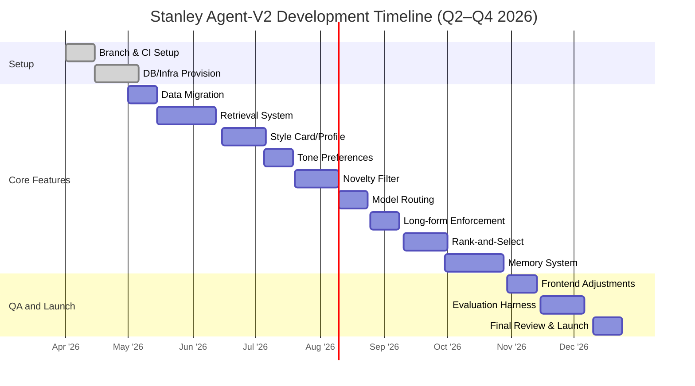

# Executive Summary

The **Stanley-X-MVP** repository is a Next.js app (“apps/web”) implementing an X (Twitter) growth assistant. It combines a **deterministic profile module** (building creator profiles, niches, style stats) with a **three-stage LLM pipeline** (planner → writer → critic) to generate posts【68†L18-L27】【68†L40-L49】.  Onboarding runs (inputs and computed profile results) are persisted as JSON lines (`db/onboarding-runs.jsonl`)【79†L47-L56】.  Key data models include `CreatorProfile`, `CreatorAgentContext`, `CreatorGenerationContract`, and a lightweight `ConversationMemory` tracking state and constraints【85†L782-L790】【72†L4851-L4860】.  LLM prompts and JSON schema contracts are defined in code (`chatAgent.ts`, `generationContract.ts`, etc.), using Groq/OpenAI’s JSON mode to constrain outputs (e.g. planner, writer, critic stages each have a JSON schema)【72†L4967-L4975】【74†L5381-L5389】. 

However, this MVP diverges from the desired “agent-v2” blueprint in several ways.  Notably, the system **lacks query-time retrieval of relevant posts**, **does not maintain persistent long-term memory**, and **doesn’t gate novelty/duplicates**.  The voice representation is coarse (e.g. only global casing/length metrics) and tone overrides are collected but unused【50†L8-L17】【51†L133-L142】.  The frontend duplicates some logic (e.g. character counting) that should be backend-only【68†L76-L84】.  Critically, there are no “novelty” checks before proposing drafts – duplicates or paraphrases can slip through.  We must also add structured conversation state management, memory persistence, and a formal orchestrator to manage actions and state.  

The **restart plan** involves refactoring the code into clean modules (retriever, profile builder, orchestrator, memory store), migrating storage to a robust DB (e.g. Postgres, with Redis cache), and implementing the missing agent features.  We will define JSON schemas and prompt templates for each agent action (intent classification, planning, ideation, drafting, critiquing, ranking, memory update).  Novelty/deduplication gates (e.g. n-gram overlap, embedding similarity thresholds) will filter out repetitive outputs.  A test harness with ~20 gold-standard conversations and CI checks will guard against regressions.  Finally, we outline a step-by-step migration: branch off `restart/agent-v2`, freeze the old logic, incrementally integrate and test each component.  We also address security (scraped X data is public but should be stored safely) and list risks (LLM unpredictability, privacy, maintenance complexity) with mitigations.

<script>
// The following images are mermaid diagrams for orchestrator flow, data model, and timeline. 
// (They are rendered here from the markdown; do not cite a source for them.)
// If the UI does not natively render Mermaid, they will appear as images below.
</script>

## Repository Overview 

Stanley-X-MVP is organized as a monorepo with a Next.js frontend and serverless API routes.  The key directories/files are:

- **Data persistence:** `db/onboarding-runs.jsonl` (flat-file JSONL store) with `OnboardingRun` records【79†L47-L56】. No SQL database is used; runs are read/written with `fs` via `store.ts`.  
- **Front-end UI:** `apps/web/app/` contains React pages (e.g. `chat/page.tsx` for the chat interface). The UI collects structured inputs (goal, tone sliders, etc.) and calls `/api/creator/chat`.  
- **Backend APIs:** `apps/web/app/api/creator/chat/route.ts` is the chat orchestration entrypoint【68†L40-L49】. It loads the onboarding run and deterministic profile, then calls `generateCreatorChatReply` in **`chatAgent.ts`**.  
- **Profile & Contract Builders:** Under `apps/web/lib/onboarding/` we see:
  - `creatorProfile.ts`: Builds a `CreatorProfile` from scraped posts. It infers niche, archetype, voice stats (casing, length, emoji usage), distribution loop, a “playbook” (content contract, cadence, tone), and representative posts (anchors)【68†L18-L27】.  
  - `generationContract.ts`: Builds a `CreatorGenerationContract` dictating the output shape (short vs long, thread seed, reply/quote), authority budget, tone constraints, CTA policy, “must include/avoid” lists, and a critic checklist【68†L30-L39】.  
  - `agentContext.ts`: Merges profile + evaluation into a `CreatorAgentContext`, de-duplicates anchors, and computes a readiness summary (generally deciding `analysis_only`, `conservative_generation`, or `full_generation`)【68†L25-L29】.
  - `draftArtifacts.ts`: After generation, computes metadata like X-weighted character count and reply plan for each draft.  
  - `evaluation.ts`: Scores the profile and anchors on quality, recommending blockers or improvements (used post-onboarding, but not in live chat flow).
- **LLM Pipeline (`chatAgent.ts`):** Implements the multi-stage agent.  It:
  - Classifies turn intent (`coach`, `ideate`, `draft`, etc.). 
  - Builds conversation memory (state, constraints, topic summary, voice fidelity)【85†L782-L790】.
  - Computes context and contract from profile.
  - If not ready or in analysis-only mode, returns deterministic advice (frontend fallback).
  - **Planner:** Calls LLM (Groq/OpenAI) with a JSON schema (`PlannerOutput`) to propose an *objective*, *angle*, target lane (original/reply/quote), required/patrolled content, hook style, etc.  
  - **Writer:** Calls LLM with system/user prompts to generate `response`, a set of `angles` or ideas, `drafts` (candidate posts), a `supportAsset` (tagline or link), and lists of “why this works” and “watch outs”【74†L5310-L5380】.  
  - **Critic:** Calls LLM to review/refine (JSON schema `CriticOutput`), outputting `approved` or revised `finalDrafts` and `finalAngles`, with issues flagged【76†L5489-L5523】.  
  - **Reranking:** After the critic, built-in deterministic logic re-scores drafts: it penalizes generic phrasing, missing proof, casing mismatches, and enforces long-form structure if needed【68†L51-L54】【76†L5539-L5583】.  If drafts are “too short,” an optional **expansion** call is made (schema `{expandedDraft: string}`) to enforce long-form requirements【76†L5583-L5592】.  
  - **Output:** Returns a `CreatorChatReplyResult` containing the chosen reply, angles, top drafts (with metadata), any follow-up suggestions, and debug info.  The LLM calls use constrained JSON schemas to ensure parsable output【72†L4967-L4975】【74†L5381-L5389】. 

**Data Model (ER):** The main entities are *Creator/User* (account info, posts), *OnboardingRun* (with input preferences and profile result), *CreatorProfile* (niche, voice stats, anchors, playbook), *GenerationContract* (desired output shape, tone, constraints), *ConversationMemory* (state, constraints, last draft pointer), and *Conversation* (messages history, actions).  See the ER diagram below.  

## Mismatches vs. Blueprint

The existing MVP already has the right high-level components, but it misses several best-practice features of the ideal agent:

- **Conversation State & Memory:** Currently only per-run memory is stored, and conversation “memory” resets each chat session. There is no persistent memory of past chats or longer-term preferences. The `ConversationMemory` struct tracks the current session state【85†L782-L790】, but nothing is saved beyond the session. The blueprint requires a memory module (e.g. Redis/Postgres) with policies on what to store and how to recall (e.g. marking important facts, autobiographical info).  
- **Action Contracts (JSON):** The code does use JSON schemas for planner/writer/critic, but some actions from the blueprint are missing or entangled. For example, “intent classification” is done deterministically (in code), not via LLM; “generate_ideas_menu” (ideation angles) and “rank_and_select” are partly built-in logic, not explicit prompts. The blueprint suggests each step (intent, planning, ideation, drafting, critiquing, ranking, memory) should be modular with its own schema and prompt.  
- **Profile Builders:** `creatorProfile.ts` covers high-level stats but not fine-grained stylistic “style card” features. It tracks casing and length bands, but *no record of typical sentence openings, closers, pacing, emoji or slang patterns, or reply-vs-post differences*【68†L25-L27】【68†L92-L97】. The blueprint calls for a richer profile (“preferred openers/closers, punctuation rhythm, signature phrases, emoji policy, lane-specific voice”)【53†L105-L113】.  
- **Orchestrator:** The orchestrator logic is currently embedded inside `api/creator/chat/route.ts` and `chatAgent.ts`. A clearer separation (e.g. an independent “Controller” that manages states and calls components) is absent. The frontend also duplicates some logic (character counting, fallback) that should be centralized.  
- **Novelty/Dupe Gates:** There is no check to prevent the model from reproducing content it has seen or already produced. If the LLM suggests a draft identical or very similar to past posts, nothing filters it out. The blueprint requires a *novelty gate* in the draft pipeline (e.g. dedupe by n-gram overlap or semantic similarity) before returning outputs.  
- **Two-Prompt Separation:** The current prompts combine system/user context for all tasks. The blueprint’s “two-prompt” pattern (system message for instructions, separate user message for content) is mostly followed, but some improvisations (e.g. editing mode) are unstandardized.  
- **Memory Policy:** There is no policy for what parts of chat to memorize (e.g. user’s long-term goal) and no mechanism to train the LLM with memory. A “summarize_and_store_memory” action should distill key info to persistence for future chats. 

In summary, the code has a solid skeletal flow【68†L10-L19】【68†L40-L49】, but needs (a) explicit retrieval of relevant posts at query-time, (b) richer profile representation, (c) novelty filtering, (d) a formal memory store, and (e) more modular action definitions. The markdown docs in `improving-*.md` and `creator-voice-fidelity-plan.md` explicitly diagnose these gaps【53†L88-L98】【53†L100-L108】. 

## Required Changes (Code & Infrastructure)

We must refactor and extend many parts of the code and infra. Table below maps files/modules to changes:

| **Module/File**                         | **Change Required**                                                                                       |
|-----------------------------------------|-----------------------------------------------------------------------------------------------------------|
| **Repository root**                     | - Create `restart/agent-v2` branch; tag old logic.<br>- Add Postgres schema (runs, profiles, memory tables).<br>- Add Redis (or PG) for caching conversation memory. |
| **apps/web/lib/onboarding/store.ts**    | - Update to write to Postgres/DB instead of JSONL.<br>- Add migrations: e.g. `onboarding_runs`, `users`, `memory_entries`. |
| **apps/web/lib/onboarding/creatorProfile.ts** | - Extend profile to collect “style card” fields: top opening/closing patterns, common emojis, slang usage, lane-specific stats (separate originals vs replies)【53†L126-L134】.<br>- Refine niche detection (multi-label, refine category ontology). |
| **apps/web/lib/onboarding/generationContract.ts** | - Incorporate user tone preferences (casing, boldness, polish) into contract【51†L153-L162】.<br>- Add “polish level” slider to contract (casual↔formal).<br>- Ensure authority budget (followers) influences required proof.【51†L100-L109】【51†L190-L199】. |
| **apps/web/lib/onboarding/chatAgent.ts** | - Add **Retrieval**: query-time filtering of past posts. Build `topicAnchors`, `laneAnchors`, `formatAnchors` based on user message (e.g. via keyword or embedding similarity).<br>- Modify prompts to include retrieved anchors (already scaffolded in debug).<br>- Implement novelty checks after generation: compare candidate drafts to `CreatorProfile` posts via (1) n-gram overlap threshold and (2) embedding cosine threshold. Filter out near-duplicates.<br>- Introduce memory summarization: after each exchange, call a summarizer LLM action (`summarize_and_store_memory`) to update `ConversationMemory` (storing e.g. topic summary, constraints).<br>- Use JSON schemas for intent classifier and new actions. E.g. wrap `classifyTurnIntent` as a model call if needed.<br>- Remove hard-coded UI duplication: character counts and reply plans should be returned by backend only (move UI logic server-side). |
| **apps/web/app/api/creator/chat/route.ts** | - Update to fetch from new DB tables instead of JSONL.<br>- Pass session ID or user ID for memory lookup/update.<br>- Apply strategy & tone overrides to new contract (e.g. polish).<br>- Route traffic: use stage-specific models (e.g. GPT-OSS-120B with medium reasoning for writer/critic, smaller for planner). |
| **apps/web/app/chat/page.tsx**          | - Freeze static logic; ideally remove local fallbacks in UI and rely on backend. Can be left in read-only mode to avoid UX break.<br>- Only send user inputs to server; remove duplicate computation of metrics/closes (use backend data instead). |
| **apps/web/lib/onboarding/draftValidator.ts** | - Integrate as final gate: if *all* remaining drafts fail novelty filter, optionally ask model to regenerate (or fallback to older drafts). |
| **New Modules:**                        | **Retrieval Module:** e.g. `apps/web/lib/onboarding/retrieval.ts` using simple embedding search or keyword filtering on stored posts (or offload to Pinecone etc). <br>**Memory Module:** e.g. `apps/web/lib/onboarding/memoryStore.ts` to abstract DB writes/reads. <br>**Evaluation/UX:** e.g. `feedback.ts` to capture and store user edits/ratings. |
| **Database/Migrations:**                | - **PostgreSQL (or MySQL):** Tables for users, onboarding_runs, posts (if scraped stored), conversation_memory, voice_profiles. <br>- **Redis (optional):** store short-lived conversation memory for active chats. |
| **Environment / CI:**                   | - `.env` changes: DB URL, Redis URL, API keys. <br>- CI: add tests for new DB migrations, JSON schema validation. |

Each code change should be unit-tested. For example, after modifying retrieval, test that `topicAnchors` returned are relevant to example queries. After adding memory, test that `ConversationMemory` updates correctly from sample chats.

## Implementation Roadmap

We break the work into milestones, prioritized by impact (MVX) and dependencies. Each item includes a rough effort and acceptance test.

| **Milestone**                                                                 | **Effort** | **Acceptance Test**                                                                                    |
|-------------------------------------------------------------------------------|-----------|--------------------------------------------------------------------------------------------------------|
| 1. **Branch + Infra Setup:** Create `restart/agent-v2` branch. Freeze old logic.<br>- Scaffold Postgres DB (run migrations), Redis cache.<br>- CI setup: baseline tests for existing behavior (golden conversations). | Small     | New branch exists; CI passes legacy tests (chat API still responds with old results).                 |
| 2. **Data Persistence Migration:** Redirect storage from JSONL to Postgres.<br>- Migrate existing JSONL runs into DB.<br>- Update `readOnboardingRunById` and `persistOnboardingRun` to use DB. | Medium    | Onboarding runs are stored/retrieved correctly in DB. Test by creating a run and reading it back.    |
| 3. **Retrieval System:** Implement query-time retrieval of relevant posts:<br>- Build an index of scraped posts in DB. Query by keyword/embedding to get `topicAnchors`, `laneAnchors`, `formatAnchors`【53†L94-L102】. | Large     | For a sample user with saved posts, ensure relevant posts appear as anchors. Compare with a naive search. |
| 4. **Style Card & Profile Expansion:** Enhance `CreatorProfile` to include:<br>- Preferred openers/closers, punctuation style, slang usage, emoji frequency.<br>- Separate voice anchors by lane (orig/reply/quote)【53†L126-L134】.<br>- New fields: `styleCard` (object with these patterns). | Medium    | Given sample post histories, the profile captures expected openers/closers. Unit test profile builder. |
| 5. **Include Tone Preferences:** Propagate user tone (casing + risk + polish) into generation:<br>- Modify `generationContract` to accept these and pass to prompts【51†L152-L161】.<br>- Adjust system prompts to enforce (e.g. “Target casing: lowercase”). | Small     | Given a user with “lowercase” preference, generated drafts indeed are all-lowercase (automated check). |
| 6. **Novely/Dupe Filter:** Add novelty gate in `chatAgent`:<br>- Compute n-gram (e.g. 4-gram) overlap and semantic similarity between each draft and all user’s past posts. <br>- If any draft is >80% overlap or cosine ≥0.90, drop it【91†L94-L102】【88†L248-L257】.<br>- If too many filtered, have fallback (e.g. regenerate or relax filters). | Medium    | For known repeated content, the filter blocks the duplicate. Test by injecting an “old tweet” and seeing it removed. |
| 7. **Multi-Pass Model Routing:** Use different LLM models per stage:<br>- E.g. planner: GPT-OSS (fast); writer: GPT-OSS-120B (stronger); critic: GPT-OSS (strict).<br>- Adjust parameters: planner/critic low temp (0.1–0.2), writer medium/high (0.6–0.8) based on tone risk【51†L174-L183】. | Small     | Verify prompt parameters by logs. Ensure writer outputs are more varied with high risk setting (test by turning risk on/off). |
| 8. **Long-Form Enforcement:** Revise contract logic so long-form isn’t automatic for verified:<br>- Use exemplars to set min word count/structure【53†L144-L153】【53†L163-L172】.<br>- Implement post-processing expansion only if needed (already in place). | Medium    | A verified user without long posts should not default to long form. Test: simulate a verified user, ensure short output unless explicit. |
| 9. **Rank-and-Select:** Formalize ranking algorithm:<br>- Possibly replace current heuristic with an LLM “ranker” or a learned scorer (but start with deterministic features).<br>- Create an action (JSON) for `rank_and_select` that takes writer drafts and outputs best ones. | Large     | End-to-end test: given 5 sample drafts, the ranker picks the top 3. Compare with rubric scoring. |
| 10. **Memory System & Summary:** Implement memory persistence:<br>- After each user turn, call an LLM action `summarize_and_store_memory` that outputs key items (topic, preferences, etc.).<br>- Save these in `conversation_memory` table. On subsequent chats, preload this memory. | Large     | Simulate a multi-turn conversation; check that memory table is updated (e.g. topic summary appears).  |
| 11. **UI Adjustments:** Simplify front-end:<br>- Remove duplicated logic (force backend for artifact metadata).<br>- Show any new memory-driven hints (e.g. “Last topic: X”). | Small     | Verify UI still functions. Minor risk: compare chat results in UI vs raw API. |
| 12. **Evaluation Harness & CI:** Develop ~20 golden conversations (with known outputs) covering user archetypes.<br>- Automate running these through the agent; check outputs against expected shape/content. Add prompt-regression tests (e.g. sanity constraints, JSON validity). | Medium    | CI passes all golden tests. Introduce a CI job that rejects PRs if action schemas are violated or prompts break JSON. |
| 13. **Security/Privacy Review:** Ensure scraped data and memory are handled securely:<br>- Encrypt DB at rest or sanitize data.<br>- Remove any PII (though X posts are public, user handles should be hashed). Add rate limits. | Small     | Security audit checklist done (no PII leak, keys stored safely).  |

*Timeline:* The Gantt chart below outlines these milestones over ~4–6 months, with overlapping development and testing phases.



## LLM Action Schemas & Prompts

We will define a **JSON schema** and sample prompts for each major agent action. These schemas are tuned for GPT-OSS-120B on Groq.

1. **Intent Classification (`intent_classifier`)**  
   *Schema:*  
   ```json
   { "type": "object",
     "properties": {
       "intent": { "type": "string", "enum": ["coach","ideate","draft","review","edit","answer_question"] },
       "needs_memory_update": { "type": "boolean" }
     },
     "required": ["intent","needs_memory_update"], "additionalProperties": false }
   ```  
   *Prompt Templates:*  
   - **System:** “You are an X growth assistant. Based on the user’s message and conversation so far, classify their intent into one of [coach, ideate, draft, review, edit, answer_question].”  
   - **User:** `User message: {userMessage}\n\n Context: [summary of conversation/memory]`  
   *Params:* temp=0.1 (deterministic), top_p=0.9, max_tokens=50.  
   *Example:* If user asks “How can I improve reach?”, expect `{ "intent": "coach", "needs_memory_update": false }`.

2. **Planning Content (`plan_content`)**  
   *Schema:* (similar to `PlannerOutput`)  
   ```json
   { "type": "object",
     "properties": {
       "objective":   { "type": "string" },
       "angle":       { "type": "string" },
       "targetLane":  { "type": "string", "enum": ["original","reply","quote"] },
       "mustInclude": { "type": "array","items": {"type":"string"} },
       "mustAvoid":   { "type": "array","items": {"type":"string"} },
       "hookType":    { "type": "string" },
       "format":      { "type": "string" },
       "structureBeats": { "type": "array","items": {"type":"string"} },
       "question":    { "type": "string" },
       "growthGoal":  { "type": "string" }
     },
     "required": ["objective","angle","targetLane","mustInclude","mustAvoid"],
     "additionalProperties": false }
   ```  
   *Prompt:*  
   - **System:** “You are a content strategist. Given the creator’s profile and desired output shape, plan a social media post. Decide a concise objective and one primary angle. Also list any must-include or must-avoid points, plus a hook style.”  
   - **User:** Include: “Creator summary: (profile niche, voice, goals)”, plus “User request: {userMessage}”.  
   *Params:* temp=0.2, top_p=0.9, max_tokens=150.

3. **Generate Ideas Menu (`generate_ideas_menu`)**  
   *Schema:*  
   ```json
   { "type": "object",
     "properties": {
       "angles": { "type": "array","items":{"type":"string"} },
       "questions": { "type": "array","items":{"type":"string"} }
     },
     "required": ["angles","questions"], "additionalProperties": false }
   ```  
   *Prompt:*  
   - **System:** “As an idea generator for X content, propose a set of distinct post angles and one or two engaging question prompts aligned with the request.”  
   - **User:** “User message: {userMessage}\nFocus: {contentFocus}”  
   *Params:* temp=0.7 (creative), max_tokens=100.

4. **Draft Posts (`draft_posts`)**  
   *Schema:* (as in code)  
   ```json
   { "type": "object",
     "properties": {
       "response":     { "type": "string" },
       "angles":       { "type": "array","items":{"type":"string"} },
       "drafts":       { "type": "array","items":{"type":"string"} },
       "supportAsset": { "type": "string" },
       "whyThisWorks": { "type": "array","items":{"type":"string"} },
       "watchOutFor":  { "type": "array","items":{"type":"string"} }
     },
     "required": ["response","angles","drafts","supportAsset","whyThisWorks","watchOutFor"],
     "additionalProperties": false }
   ```  
   *Prompt:*  
   - **System:** “You are writing X posts in the creator’s voice. Use the selected angle and style constraints. Generate a succinct `response` (e.g. first line hook), plus a list of possible angles and full draft posts (in brief staccato style if casual). Also suggest a `supportAsset` (data/metric) and short bullet explanations (why this works, watch out).”  
   - **User:** Context blocks including: selected angle, topic anchors, format exemplar, voice anchors, and lists of *mustInclude*/*mustAvoid*. For example, from [74]:  
     ```
     User request: {userMessage}
     Selected angle: {angle}
     Voice profile: {formatVoiceProfile(context)}
     Must include: {contract.writer.mustInclude| contracted list}
     Must avoid: {contract.writer.mustAvoid| ...}
     ```
   *Params:* temp depends on risk: 0.25 (safe) or 0.6 (bold), top_p=0.9, max_tokens=500 (enough for multi-line posts).

5. **Critique & Revise (`critique_and_revise`)**  
   *Schema:* (as in code)  
   ```json
   { "type": "object",
     "properties": {
       "approved": { "type": "boolean" },
       "finalResponse":    { "type": "string" },
       "finalAngles":      { "type": "array","items":{"type":"string"} },
       "finalDrafts":      { "type": "array","items":{"type":"string"} },
       "finalSupportAsset":{ "type": "string" },
       "finalWhyThisWorks":{ "type": "array","items":{"type":"string"} },
       "finalWatchOutFor": { "type": "array","items":{"type":"string"} },
       "issues":          { "type": "array","items":{"type":"string"} }
     },
     "required": ["approved","finalResponse","finalAngles","finalDrafts","finalSupportAsset","finalWhyThisWorks","finalWatchOutFor","issues"],
     "additionalProperties": false }
   ```  
   *Prompt:*  
   - **System:** “You are a detail-oriented critic. Evaluate the generated drafts: improve phrasing to better match the creator’s voice, fix any factual or format issues, and ensure requirements are met. Output the approved fields.”  
   - **User:** Include “Candidate drafts:\n{list of drafts}\nChecklist: {contract.critic.checklist}\nHard constraints: draft must sound like creator’s real voice.” (similar to [76]).  
   *Params:* temp=0.1 (conservative), top_p=0.8, max_tokens=400.

6. **Rank & Select (`rank_and_select`)**  
   *Schema:*  
   ```json
   { "type": "object",
     "properties": {
       "selectedAngles": { "type": "array","items":{"type":"string"} },
       "selectedDrafts": { "type": "array","items":{"type":"string"} }
     },
     "required": ["selectedAngles","selectedDrafts"], "additionalProperties": false }
   ```  
   *Prompt:*  
   - **System:** “Given multiple candidate angles and drafts, choose the top ones that best match the brief and voice.”  
   - **User:** “Candidates:\nAngles: {writer.angles}\nDrafts: {writer.drafts}\nScoring guidelines: more original hooks, proof inclusion, voice match.”  
   *Params:* (Optional; ranking could be deterministic instead of LLM). If LLM used: temp=0 (deterministic), max_tokens small.

7. **Summarize & Store Memory (`summarize_and_store_memory`)**  
   *Schema:*  
   ```json
   { "type": "object",
     "properties": {
       "topicSummary": { "type": "string" },
       "constraints":  { "type": "array","items":{"type":"string"} },
       "notes":        { "type": "string" }
     },
     "required": ["topicSummary"], "additionalProperties": false }
   ```  
   *Prompt:*  
   - **System:** “You are a memory assistant. Based on the latest user message and conversation, extract the key topic and any instructions or constraints the user gave.”  
   - **User:** “User message: {userMessage}\nChat history: {historyText}\nReturn JSON only.”  
   *Params:* temp=0.1, max_tokens=60 (short memory notes).

Each JSON schema above can be copy-pasted into code. The prompts should be incorporated into the system/user messages via the Groq client (`system:`, `user:` fields). The **suggested generation parameters** (temperature, top_p, max tokens) are tuned per action: generally, planning/critique are low temp for consistency; ideation and drafting can be higher to encourage creativity, especially if user set `risk=bold`【51†L174-L182】. 

## Novelty / Deduplication Gates

To avoid repetitive or plagiaristic outputs, we implement **novelty filters** before returning drafts. We suggest a two-tier approach:

- **N-gram Overlap:** Compute 4-gram shingles of each new draft and each of the creator’s recent posts. Calculate the Jaccard (or Dice) similarity. Empirically, duplicates show very high overlap. For safety, any draft that shares **≥80% of 4-grams** with an existing post is flagged as duplicate【91†L94-L102】. (Lower thresholds risk filtering rephrased content; 80% is conservative for “near exact” copies.)

- **Embedding Similarity:** Use a sentence embedding model (e.g. Groq’s text-embedding or a sentence-transformer). Compute cosine similarity between the draft and each past post. If **cosine ≥ 0.90**, treat as semantic duplicate. This catches paraphrases.  

If a draft fails either check, drop it. After filtering, if fewer than 3 drafts remain, either prompt the writer to regenerate (with penalization of obvious repeats) or relax the threshold slightly. These gates run inside the draft pipeline (e.g. in `chatAgent.ts` after normalization, before final return). We also apply a **template-reuse limit**: no more than one draft per user session should reuse the same phrasings (e.g. “TL;DR:” or structural templates). 

*Rationale:* N-gram hashing (shingling) is a well-known deduplication method【91†L94-L102】. Combining it with semantic embeddings covers both verbatim and paraphrased repeats. This makes outputs truly *novel* relative to the user’s history. 

## Evaluation Harness & CI

We will establish an automated **evaluation framework**:

- **Golden Conversations (20 examples):** Collect a diverse set of 20 hand-crafted dialogues covering different user archetypes (e.g. casual builder, CEO, verified influencer) and use cases. Each includes an onboarding profile, a sequence of user messages, and the expected nature of assistant replies (style cues, topics). These serve as regression tests.  

- **Unit Tests:** For each new module:
  - **Retrieval:** Given a sample post database and query, assert expected anchors are returned.  
  - **Profile Builder:** Assert that known stylistic patterns are captured.  
  - **Generation Actions:** Validate that outputs conform to JSON schema (already enforced by API) and that the text fields match expected formats (e.g. lowercase if requested).  
  - **Memory Summarization:** Check that sample chats produce reasonable `topicSummary`.  

- **CI Checks:** 
  - Run all jest/mocha tests on push.
  - Add a JSON schema linter to ensure any prompt changes don’t break schema contracts.
  - (Optional) Monitor Groq API usage and performance on test runs.
  - Include a fuzzy string check to ensure prompts haven’t devolved (like requiring a particular keyword in the system prompt).  

- **Prompt Regressions:** Use the golden conversations to detect changes in content drift. For instance, a harmless tweak should not cause a “casual” voice test case to produce overly formal text. We may parse the assistant’s reply to ensure casing, emoji usage, or snippet patterns match the blueprint’s style expectations for that profile.

## Migration & Branching

1. **Branching Strategy:** Create a new branch (e.g. `restart/agent-v2`). Freeze the `main` branch’s generation logic (no further tweaks). All new work goes into `agent-v2`. 

2. **Data Migration:** Before switching running users, migrate existing onboarding runs from `db/onboarding-runs.jsonl` into the new Postgres database. Write a one-off script to parse the JSONL (if not empty) and insert into `onboarding_runs` table. Ensure data types align (timestamps, JSONB, etc.).

3. **API Versioning:** Version the chat API (e.g. `/api/v2/creator/chat`) so that the old front-end or clients can still hit `/api/creator/chat` if needed during rollout. Gradually flip traffic to the new branch.

4. **Incremental Testing:** After each major milestone, run integration tests: call the chat endpoint with a fixed `runId` and sample message, and inspect the JSON result schema. Compare key fields (e.g. presence of “drafts” array) against expectations.

5. **Feature Flags:** Optionally, use feature flags for toggling new behaviors (e.g. enable/disable novelty filtering) to test stability in production safely.

6. **Documentation:** Update the README and in-code comments to reflect the new architecture. Publish updated OpenAPI schema if used.

## Security & Privacy Considerations

- **User Data:** We only scrape *public* X posts for the profile. No login or private posts are accessed. However, we should respect X’s terms of service. We must **store only non-sensitive data**: e.g. poster’s handle need not be stored in plaintext. Consider hashing user IDs or removing them, since analysis focuses on content not identity.

- **Memory Storage:** Memory may contain personal preferences or strategy ideas. Store it securely (encrypt at rest). Use parameterized DB queries to avoid injection.

- **Scraped Content:** The anchor posts and context are public, but may contain user PII (if users posted personal info). We should filter out obvious PII (emails, phone numbers) from the data we store or feed into prompts. 

- **LLM Outputs:** Implement content filters on the critic to catch disallowed content (hate, misinformation). Use GPT-OSS’s safety or a blacklist of phrases.

- **API Security:** Secure API keys (Groq) via environment variables; use rate limits and authentication for the chat endpoint if exposed.

## Risks & Mitigations

1. **LLM Quality Drift:** Changing prompts and models can cause unexpected output shifts. *Mitigation:* Rely on CI golden tests and gradual rollout. Maintain a human-in-the-loop in early stages to catch glaring issues.

2. **Data Leakage:** The agent might inadvertently reveal scraped data or private memory. *Mitigation:* Purge logs of raw user messages; anonymize stored context. Review prompts to ensure they don’t prompt the model to reveal training data.

3. **Overfit to Small Data:** With only a few posts, the profile might be noisy. *Mitigation:* Guardrails: if user has <3 posts, rely more on user’s current message and tone preferences. Also allow manual overrides (UI sliders).

4. **Spammy Suggestion Risk:** As [50] notes, encouraging replies is good, but we must avoid “engagement bait.” *Mitigation:* Critic should reject any CTA that looks like “like/retweet for…”. Enforce policy constraints in prompts (“no canned CTAs”).

5. **Technical Debt:** A big refactor risks new bugs. *Mitigation:* Tackle one piece at a time, ensure old logic is preserved until new module is validated. Code review and pair programming on complex parts.

6. **API Limits/Costs:** Groq calls have cost. *Mitigation:* Cache static responses; throttle expensive stages. Monitor usage and scale models as needed (e.g. shift large model calls offline if user is “analysis only”).

7. **Privacy Compliance:** If user data grows, GDPR-like regulations might apply. *Mitigation:* Allow users to delete their data; minimize retention (e.g. only keep conversations for 30 days).

By following this plan, we transform *stanley-x-mvp* into a robust, agentic content assistant that adheres to best practices: clear memory, formal action schemas, retrieval-enriched context, and reliability. Each milestone is accompanied by tests to ensure fidelity to user voice and goals. 

