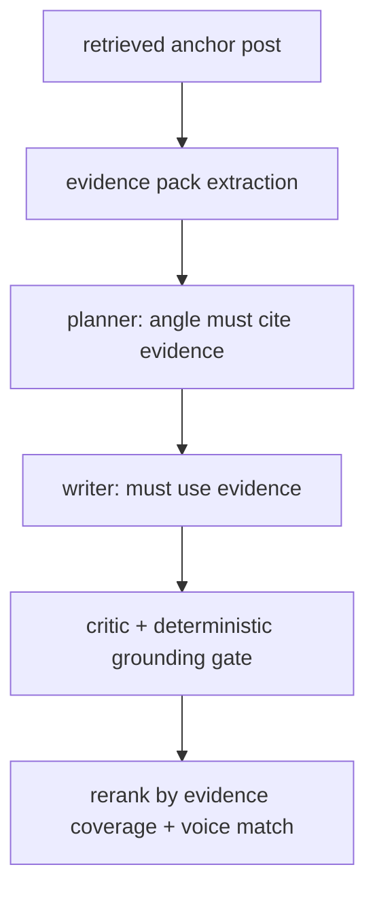

# Signal Loss Diagnosis in Your X Growth Assistant Generation Pipeline

## Executive Summary

Your system is **retrieving the right scraped post**, but it is **not converting that post into a high-salience, enforceable evidence object** inside the generation contract. Concretely: the pipeline treats the retrieved post primarily as a **format/style reference**, not as **content evidence with mandatory proof points**—so the LLM “sees” metrics/entities in debug, but the writer is never forced (or even strongly encouraged) to use them.

The three biggest reasons the output stays generic:

- **The exemplar is framed as “structure, not topic”** at the prompt/contract level, so the model learns (correctly) that the retrieved post’s concrete nouns/metrics are *not* supposed to drive the content. That design choice matches your debug symptom exactly.
- **The planner is not evidence-aware early enough**, so it over-abstracts into broad “operator lessons” before the writer step even begins; by the time the writer sees anchors, it is already constrained by the abstract plan.
- **There is no hard “grounding enforcement” loop**: neither the critic nor deterministic reranking verifies “did we reuse concrete proof (entities/metrics) from the retrieved anchor?”—so drafts can pass while staying vague.

This is a known limitation of long-context prompting: LLMs can ignore relevant context even when it is present, especially if it is not surfaced as explicit constraints. Empirically, performance can degrade when relevant information is buried in the middle of long contexts (“lost in the middle”). citeturn4search0

## How the Current System Actually Works

### End-to-end data path

From the files you highlighted, the workflow is:

- **Frontend (`apps/web/app/chat/page.tsx`)** collects:
  - freeform message, or structured intent (ideate/draft/review), content focus, optional selected angle
  - tone settings (casing/risk) and strategy settings
  - optional pinned reference post ids (currently chosen from voice-anchor sets)
- **Backend route (`apps/web/app/api/creator/chat/route.ts`)**:
  - loads onboarding run by `runId`
  - applies strategy + tone overrides
  - calls `generateCreatorChatReply()` (LLM pipeline)
  - falls back to `buildDeterministicCreatorChatReply()` on errors

### Deterministic layer vs LLM layer

**Deterministic layer (what you have today):**
- Creator modeling (voice, niche, loop, style card, anchors, confidence/readiness) via creator profile + agent context.
- A **generation contract** that decides:
  - lane (original/reply/quote)
  - output shape (short/long/thread/reply/quote)
  - “must include / avoid” constraints
  - target tone casing + risk
- Anchor selection utilities that choose:
  - **format exemplar** (good for structure)
  - topic/voice anchors and pinned references (context)

**LLM layer (today’s staged flow):**
- Planner → Writer → Critic (plus reranking), driven by `chatAgent.ts`.

### Where frontend may still influence behavior incorrectly

You’ve largely respected the “backend owns behavior” principle: the UI sends **structured fields** and the backend decides the output shape. However, there is still **soft leakage**:

- The client infers initial tone defaults based on observed stats (e.g., deciding lowercase vs normal casing) and sends those settings back as overrides. This is not “prompt injection,” but it does mean behavior can drift if client defaults diverge from server logic over time.
- Pinned reference candidates are limited to “voice anchors” (not “best performing” or “topic anchors”). This makes “pin a specific high-performing long-form post as a grounding anchor” harder than it should be for the user—especially in the failure case you described.

## Root Causes of the Current Quality Problems

### Scraped-post grounding: you have the post, but you don’t have *evidence*

In your current design, the retrieved post primarily shows up as:

- a **format exemplar** (structure/blueprint)
- optionally as an anchor text blob in prompts

But the pipeline does **not** consistently produce a normalized “evidence pack” such as:

- extracted entities (startup name, product names, locations)
- extracted metrics (ARR, headcount, conversion %, time-to-ship)
- extracted causal claims (“we did X → got Y”)
- extracted “receipts” (screenshots, dashboards, repo links)
- extracted “story beats” (problem, constraint, turning point, outcome)

Without that deterministic extraction step, the writer is free to ignore details, and in long prompts it often will. This is consistent with long-context behavior findings: models do not reliably use relevant information when it is not positioned and framed correctly. citeturn4search0

### Signal loss across the pipeline: the plan becomes generic, and the writer obeys the plan

Your reported symptom (“debug shows the right exemplar, but the output is generic”) aligns with a specific lossy pattern:

- **Retriever** finds the right post ✅
- **Planner** turns the request into a high-level lesson/theme (e.g., “operator lessons”) ❌
- **Writer** follows the planner’s abstraction and treats the exemplar as “structure only” ❌
- **Critic** checks for genericness *in aggregate* but does not enforce “use these specific proof points” ❌
- **Reranker** optimizes for readability/compliance, not for “evidence utilization,” so generic drafts survive ❌

This is exactly the kind of “RAG failure mode” that modern evaluation frameworks call out: retrieval quality and generation faithfulness are different dimensions; you can retrieve relevant context and still generate ungrounded outputs. citeturn6search3turn6search6

### The exemplar is currently treated more like a “format mold” than a “content anchor”

Your own debug output in the UI (“Format Exemplar”, “Format Blueprint”) is a tell: the architecture is optimized around **format matching**, not **proof-point reuse**.

That is not inherently wrong—you *should* use exemplars as structural molds—but your product goal explicitly requires more:

- *X-native authenticity is specificity.*  
  You want drafts that include concrete proof (metrics, constraints, named things) and not vague “teachy” text.

Your current contract/prompting path is effectively telling the model: “Use this post to learn how to write, not what to say.” That makes it unsurprising that it outputs generic advice.

### Critic logic likely rejects “too generic” but doesn’t reject “missing evidence”

A critic can be strong at style policing (“don’t sound corporate”) and still fail at grounding policing (“you ignored the post’s real metrics”). If the critic prompt doesn’t explicitly ask:

- “Which concrete entities/metrics from the evidence pack were used?”
- “If none were used, force rewrite”
- “Reject if new numbers are invented”

…it will let generic-but-plausible drafts through.

### Deterministic fallback is not evidence-synthesizing

Your fallback exists (good), but in a grounding-first product it should be designed as:

- **evidence-driven template synthesis**, not generic templates

Because today’s failure mode is: “LLM didn’t use evidence even when available.” A good fallback should become the “minimum acceptable grounded output.”

### Long-form / verified handling: “long form” needs skeleton + proof density, not just a higher limit

Your system correctly recognizes that long-form exists on entity["company","X","social network"] and that the long-form limit can be much larger than 280. But “long-form” doesn’t mean “a longer paragraph.” It typically requires:

- a clear thesis
- multiple beats/sections
- proof blocks (numbers, screenshots, constraints)
- a rhythm consistent with the creator’s true long-form patterns

This is also where the “lost in the middle” issue becomes more acute: long-form prompts + many anchors increase the chance the model drops key specifics. citeturn4search0

## Top 10 Highest-ROI Improvements

The strict priority order below assumes your stated constraint: **no creator-specific hacks and no frontend prompt steering**. Each recommendation includes: why, what to change, files, category, complexity, expected impact.

### Priority table

| Priority | Fix | Why it matters | Files to touch | Category | Complexity | Expected impact |
|---:|---|---|---|---|---|---|
| 1 | Introduce an **Evidence Pack** extracted from retrieved posts (entities, metrics, constraints, outcomes) | Turns “retrieved text blob” into enforceable grounding objects | `chatAgent.ts`, `creatorProfile.ts` (or new `evidence.ts`), `generationContract.ts` | deterministic model + contract | Medium | High |
| 2 | Make the **planner evidence-aware** and require angles to reference evidence IDs | Prevents early abstraction into generic themes | `chatAgent.ts` | prompt architecture + contract | Low–Medium | High |
| 3 | Replace “exemplar = structure only” with “exemplar = structure + acceptable proof points,” and ban invented metrics | Removes the core incentive to ignore details | `chatAgent.ts` | prompt architecture | Low | High |
| 4 | Add a **grounding critic gate**: reject drafts missing evidence, reject invented numbers/entities | Makes generic drafts fail closed | `chatAgent.ts`, `generationContract.ts` | critic + deterministic checks | Medium | High |
| 5 | Update reranking to score **evidence coverage** (not just “has a number”) | Prevents generic-but-clean drafts from winning | `chatAgent.ts` | reranking | Medium | High |
| 6 | Add a **long-form skeleton extractor** (beats/sections) derived from exemplar + evidence | Fixes “tweet-sized long form” | `chatAgent.ts` (+ new helper module) | deterministic + prompt | Medium | High |
| 7 | Expand pinned references into two explicit types: **voice pin** and **content/evidence pin** | Lets users force “use this post’s facts” without hacks | `page.tsx`, `route.ts`, `chatAgent.ts` | UI contract + contract | Medium | Medium–High |
| 8 | Reduce prompt entropy: compress strategy/style, move evidence to top and bottom | Improves salience; mitigates lost-in-middle | `chatAgent.ts` | prompt architecture | Low | Medium–High |
| 9 | Add debug output for: topic anchors, evidence pack, per-draft evidence usage | Speeds iteration and accountability | `chatAgent.ts`, `page.tsx` | debuggability | Low | Medium |
| 10 | Add offline evaluations for grounding/faithfulness (RAGAS/ARES-style) + a small regression suite | Prevents regressions; makes quality measurable | new eval harness + `evaluation.ts` | evaluation | Medium–High | Medium–High |

### Detailed recommendations

#### Evidence Pack extraction

**What to change:** after selecting the relevant post(s), run a deterministic extractor that outputs something like:

```json
{
  "anchorPostId": "123",
  "entities": ["StartupName", "ProductName"],
  "metrics": [{"key":"ARR","value":"$120k","confidence":"high"}],
  "constraints": ["no API access", "rate-limited scraping"],
  "proof": ["dashboard screenshot", "repo link"],
  "storyBeats": ["problem", "constraint", "breakthrough", "result"]
}
```

**Why it matters:** your current pipeline passes the raw post text, but the LLM is not obligated to use it. Evidence packs convert “nice-to-have context” into “must-use facts.”

**How it fixes your exact bug:** the writer and critic can now be required to include ≥N evidence items, and the reranker can score coverage deterministically.

**Implementation detail:** place the evidence pack at the **start** of prompts to avoid the “lost in the middle” degradation. citeturn4search0

#### Planner evidence-awareness

**What to change:** pass the evidence pack into planning and require:

- each angle must cite 2–4 evidence items
- each angle must name at least one entity/metric (if available)
- planner returns `evidenceIdsUsed[]` along with the angle

**Why it matters:** if the planner writes “operator lessons,” the writer follows it. The first abstraction step is where a lot of grounding is currently lost.

#### Writer prompt: remove the structural-only incentive

**What to change:** rewrite the writer instruction from “imitate structure, not topic” into:

- “use exemplar structure”
- “use evidence pack facts as proof points”
- “do not invent numbers/metrics—only use extracted ones”
- “if facts are missing, write as an observation + question rather than fabricating”

This aligns with RAG evaluation findings: faithfulness requires constraining the generator, not just retrieving context. citeturn6search3turn6search6

#### Grounding critic gate

**What to change:** add a deterministic gate *before* accepting drafts:

- must include ≥N evidence items (configurable by authority band)
- if a number exists in draft, it must match one in evidence pack
- must not introduce new proper nouns unless explicitly requested by the user message

If failed → request rewrite with explicit delta: “Draft lacked evidence items: X, Y. Rewrite using at least 2 metrics and 1 constraint.”

#### Reranking: evidence coverage as a first-class score

Right now, you likely score “proof presence” loosely (a digit, a claim). Replace with:

- evidence coverage (% used)
- evidence precision (no hallucinated evidence)
- novelty (not copy-pasting the anchor)
- voice match

This makes the behavior deterministic and debuggable (you can print the score breakdown per candidate).

#### Long-form skeleton extraction

Your verified / long-form creators need a **content skeleton**, not just a longer limit. The clean approach:

- Parse the exemplar into sections:
  - Hook / thesis
  - Context (who/what)
  - Proof block(s)
  - Turning point
  - Lessons with receipts
  - Close + conversation prompt
- Require the writer to fill each section using evidence pack facts.

This prevents “long form” from collapsing into “a short post with line breaks.”

#### Pinning: separate “voice reference” from “evidence anchor”

Today, pinning is oriented toward voice reference posts. Add a second pin type:

- Voice pins: stylistic guardrails
- Evidence pins: “use this post’s facts as grounding”

This is not a hack; it’s a reusable debugging and control tool for *any* creator.

#### Prompt compaction to mitigate long-context failures

The more you include (strategy delta, style card, multiple anchors, lane rules), the more you risk drowning the key facts. This is where “lost in the middle” matters practically. citeturn4search0

Do:
- Put evidence pack first.
- Compress strategy into 3–5 short constraints.
- Put the exemplar *structure* summary near the end (recency bias) and the evidence pack at the start (primacy bias).

#### Better debug output

Your UI already shows format exemplar and blueprint; extend debug to show:

- selected topic anchors
- extracted evidence pack (entities, metrics, constraints)
- per-draft evidence usage list

This makes the failure mode visually obvious: “draft used 0/6 extracted proof points.”

#### Offline evaluation harness

RAG evaluation research emphasizes measuring both retrieval relevance and generation faithfulness. citeturn6search3turn6search6  
Add a tiny regression suite:

- 20 real onboarding runs
- 3 typical prompts per run
- assert: at least N evidence items used, no hallucinated metrics, voice casing match, and long-form word-floor met.

## What To Avoid Right Now

These are tempting, but low ROI given the failure mode you described.

### Hardcoding creator-specific terms

Wasted effort. It solves one creator but breaks generalization and makes debugging impossible at scale.

### “Just add a database” as the fix

Not the primary bottleneck. Storage helps later for persistence, analytics, and multi-user state, but your core issue is **contract/prompt/evidence enforcement**. A DB won’t force proofs into drafts by itself.

### More frontend prompt steering

You explicitly don’t want this, and you’re right: it creates architectural drift and makes generation behavior non-auditable. Keep the frontend collecting structured inputs; keep generation logic server-owned.

### Prompt tweaks without contract and enforcement

If you don’t add evidence extraction + must-use constraints, you’ll keep seeing the same issue: the model “knows” the post but doesn’t use it. This is exactly why RAG evaluations separate retrieval and faithfulness. citeturn6search3turn6search6

### Over-investing in long-context stuffing

More anchors ≠ better. The “lost in the middle” work shows models can degrade as context grows, and position matters. citeturn4search0  
You want **less text, more structured evidence**.

## Concrete Roadmap

### Immediate

Goal: ship an evidence-first contract and stop generic drafts from passing.

- Implement deterministic Evidence Pack extraction after retrieval.
- Feed Evidence Pack into planner and require evidence IDs in planner output.
- Update writer prompt to treat exemplar as structure + allow concrete proof from Evidence Pack.
- Add deterministic grounding gate + critic rewrite loop:
  - fail drafts missing evidence
  - fail drafts with invented numbers/entities



### Short-term

Goal: fix long-form authority creators + make debugging effortless.

- Add long-form skeleton extraction and enforce beat/section minimums.
- Split pinned references into “voice” vs “evidence”; update UI accordingly.
- Expose debug: evidence pack + per-draft evidence usage.
- Update reranker scoring to include “evidence precision” (no hallucinated metrics).

### Before scaling

Goal: make quality measurable and stable across models/providers.

- Build a small regression harness:
  - grounding metrics (evidence coverage, hallucinated evidence)
  - voice match (casing, opener/closer patterns)
  - long-form completeness (min beats + min word floor)
- Add evaluation metrics inspired by RAG evaluation frameworks (retrieval relevance + faithfulness). citeturn6search3turn6search6
- Only after this, consider persistence (DB) to support multi-user, analytics, and longitudinal learning.

## Source Notes

Key external references used to support the diagnosis and roadmap:

- Long-context unreliability (“lost in the middle”) and why evidence must be surfaced and positioned as constraints. citeturn4search0
- RAG evaluation framing: retrieval relevance ≠ faithfulness; you must measure and enforce evidence use. citeturn6search3turn6search6
- Official X character counting / weighted rules (relevant to your artifact editor correctness). citeturn6search2
- Official heavy ranker description and scoring as weighted sum of predicted engagements (supports your “reply loop” product emphasis). citeturn11view0