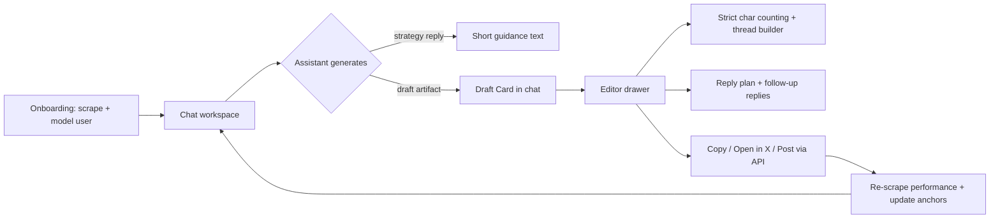
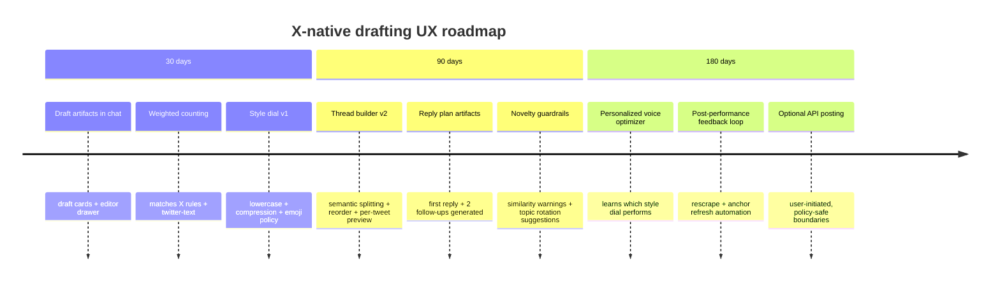

# Building an X-Native “Growth Partner” Chat Experience

## Executive summary

Your current product direction is correct: you already model the user (voice, niche, loops) and then run a planner → writer → critic pipeline that tries to keep drafts “X-native” by explicitly banning LinkedIn-ish phrases and preferring blunt, casual copy. The gap isn’t “more prompt engineering” in isolation. The gap is that X rewards a different *interaction shape* than LinkedIn, and the UI + generation contract need to make that shape the default.

Three research-backed constraints should drive the redesign:

First, X’s “For You” pipeline explicitly optimizes for *predicted engagement outcomes* at ranking time, and the system is designed to pull ~1500 candidates before ranking them. citeturn8search1 In multiple public analyses of X’s open-sourced algorithm code/configs, reply-centric behaviors (replies, “good click” into the conversation, and “reply engaged by author”) are weighted far more heavily than likes, which implies: drafts that create real conversation opportunities—and workflows that get the author to *stay active in the replies*—should be treated as first-class product features, not “nice-to-have tips.” citeturn12search4turn11search1turn11search0

Second, X’s character limit is not a flat 280 “letters”: emojis, CJK, and some Unicode count differently, and X recommends using the open-source `twitter-text` library for accurate counting. citeturn7search1 If your editor doesn’t implement this precisely, you’ll systematically produce drafts that feel “almost right” but break at the last mile—especially once users add emojis, links, or line breaks.

Third, any “growth app” on X must be careful about automation and spam policy. X’s Automation Rules explicitly warn about duplicative / substantially similar posts, discourage non-API automation (e.g., scripting the website), and note that “applications that claim to get users more followers” are prohibited under X Rules; additionally, AI-powered automated reply bots require prior written approval. citeturn7search2 Policies on platform manipulation also prohibit engagement spam and coordinated metric inflation. citeturn7search3 This means your app should (a) avoid “auto growth” framing, (b) add *duplicate detection* and *novelty enforcement*, and (c) prioritize user-in-the-loop workflows over automation.

Net: implement an “artifact-based” workflow like Stanley LinkedIn (chat generates an editable artifact) but make the artifact **X-native**: strict weighted character counting, thread builder, “reply plan” builder, follow-up reply drafting, post-duplicate guardrails, and a **style dial** (including “cracked engineer / effortless lowercase”) that can override weak historical signals for early accounts.

## What the Stanley LinkedIn UI teaches

From the HTML you pasted, Stanley LinkedIn’s core interaction pattern is:

A chat-first workspace with a persistent thread ID, where assistant messages can include a special “preview artifact” (a post preview card) that opens an editor pane. The editor is optimized for one job: take the draft and get it posted with minimal friction (word count, copy, “share”, and a lightweight “add image” affordance). It also bakes in instrumentation and feedback loops (thumbs up/down on responses, analytics scripts).  

There are two deeper product lessons here:

The UI makes the “draft” a *first-class object*, separate from the conversational text. That separation is what enables “edit”, “copy”, “share”, and later “analyze performance” workflows without forcing users to copy/paste from a paragraph buried in chat.

The interface is “preview-led”: it shows the user what the post will look like *as the platform sees it*, which reduces the last-mile mismatch between LLM text and actual posting context.

Notable implementation signals in the HTML (useful as a reference architecture, not a requirement): it integrates entity["company","Clerk","auth platform"], entity["company","Stripe","payments platform"], entity["company","PostHog","product analytics platform"], and entity["company","Calendly","scheduling platform"]—i.e., standard modern SaaS plumbing—plus per-message feedback UI and an “editor drawer” experience tuned for mobile.

What should change for X is not the “artifact + editor drawer” concept. It’s *what the artifact contains* and what the editor optimizes for: X needs thread construction, weighted character counting, reply-loop planning, and anti-duplication constraints as built-in affordances.

## X constraints that should shape the product

### Ranking incentives imply “conversation loops” are product features

X has publicly described its recommendation system as a pipeline that sources candidates (in-network and out-of-network), ranks candidates using a neural network trained on engagement outcomes, then applies heuristics/filters and product logic. citeturn8search1

Separately, X has open-sourced substantial parts of its recommendation codebase. citeturn11search7 Across multiple annotated readings of that code and related config defaults, reply-centric outcomes are treated as high-value signals compared to likes. citeturn12search4turn11search1turn11search0

For an app like yours, the practical implication is:

A “good X draft” is not just “a good standalone post.” It is a post that:
- sparks replies that are easy to write (low effort to respond, high clarity), and  
- creates a natural corridor for the author to reply back (because “reply engaged by author” is a particularly high-value event in multiple published interpretations of the open-sourced ranking configs). citeturn12search4turn11search1

So your generator should emit **two artifacts** by default:
- a draft post (or thread), and  
- a reply plan (2–5 follow-up replies the author can post to extend the conversation without sounding manufactured).

### Character limits are weighted, and the editor must implement X’s counting rules

X posts are limited to 280 characters, but X uses a weighted counting system where emojis and certain Unicode ranges count differently; X explicitly recommends using the open-source `twitter-text` library to count correctly. citeturn7search1

This matters because your target users will often:
- add emojis to signal tone (“cracked / effortless” often uses sparse emoji, but many styles do),  
- paste links (which have their own counting conventions), and  
- add line breaks.

If your in-app editor doesn’t match X’s counting semantics, users will experience “the app drafted something that doesn’t fit,” which they interpret as low quality even if the idea is good.

### Automation and “growth app” positioning must be policy-safe

X’s Automation Rules include several provisions that should directly inform your product design:

They warn against non-API automation (e.g., scripting the X website) and against posting duplicative or substantially similar content. citeturn7search2 They also note that applications claiming to get users more followers are prohibited under X rules, and that AI-powered automated reply bots require explicit prior written approval. citeturn7search2

Separately, X’s platform manipulation policy prohibits engagement spam and coordinated metric inflation behaviors. citeturn7search3

Two product consequences follow:

Your UX should strongly reinforce “you remain in control” (user-initiated posting, clear review steps).  

Your drafting engine should include **novelty/duplication checks** so the app does not encourage spammy duplication—especially important because your own user story above shows how easy it is to repeat an angle (“i already mentioned this in my previous post”).

## Why your drafts feel “too LinkedIn” and how to fix the writing engine

You’re already doing several “correct” things in your repo:

- You infer casing and voice features from recent posts (including a primary casing inference and lowercase share), and you pass voice anchors into generation.  
- Your writer prompt explicitly says to mirror casing/looseness and avoid corporate filler.  
- You have a critic stage that rejects overly generic, polished, or category-label ideation.

So why can the output still drift “less casual” than you want?

The key failure mode on X is often **voice ambiguity at small sample sizes**. At ~100 followers / early stage, the user’s *desired-direction voice* (“cracked engineer, all lowercase, short, ROI-dense”) can differ from their *historical accumulated voice* (which may be more careful, longer, or more LinkedIn-influenced). If the model treats history as truth, it will “average” toward polish.

You can fix this by introducing an explicit **Voice Targeting Layer** that sits between “inferred voice” and “writer prompt”.

### Add a “voice target” object with override precedence

Define a deterministic `VoiceTarget` resolved every request:

- Highest priority: explicit user choice in UI (e.g., toggle “lowercase” + “compressed”).  
- Next: live message cues (your `inferUserMessageVoiceHints()` already computes these—use them as hard overrides more often).  
- Next: inferred voice anchors (history).  
- Lowest: platform defaults.

Then pass `VoiceTarget` into planner/writer/critic as a single authoritative source of truth.

A concrete schema that works well for X:

- `casing`: normal | lowercase  
- `compression`: tight | medium | spacious  
- `formality`: casual | neutral | formal  
- `hookStyle`: blunt | curious | contrarian | story  
- `emojiPolicy`: none | sparse | expressive  
- `ctaPolicy`: none | “thoughts?” | question | soft ask  
- `risk`: safe | spicy (your onboarding already uses a “risk” concept)

This solves your specific case: you can choose **lowercase + tight + casual** even if your historical anchors are mixed.

### Separate “draft text” from “advisor text” in the generation contract

Right now, drafts are strings embedded in a larger assistant response payload. Stanley’s UI makes drafts artifacts.

Make your writer output produce:

- `assistant_reply`: short coaching text (optional)  
- `draft_artifacts`: structured objects, each with:
  - `type`: single | thread | reply | quote  
  - `posts`: array of strings (one per tweet if thread)  
  - `goal`: followers/leads/authority  
  - `voice_target`: the resolved voice target  
  - `reply_plan`: 1–3 follow-up replies (strings)  
  - `support_asset`: screenshot/demo suggestion (optional)  
  - `novelty_notes`: what’s new vs last N posts (string)

By forcing drafts into clean fields, you reduce the chance the writer “helpfully adds LinkedIn-y framing” inside the draft itself.

### Add a deterministic “Anti-LinkedIn postprocessor” that runs after LLM output

Even good prompts drift. On X you can safely apply a postprocessor because the target style is often *simpler*.

Recommended deterministic transforms (only apply when `voice_target.formality=casual` or `compression=tight`):

- Remove openers like “I’ve been thinking about…” when they add no payload.  
- Strip “here are 3 takeaways” unless the user explicitly wants listicle structure.  
- Replace corporate phrases with clipped equivalents:
  - “excited to share” → delete  
  - “valuable insights” → delete or replace with a specific claim  
  - “I learned that…” → “learned:” or just state the lesson  
- Enforce one-idea-per-post unless thread mode.  
- Optional: enforce lowercase if casing is lowercase (careful with proper nouns; allow whitelist).

This is also where you can run **novelty checks** to avoid “substantially similar posts,” which X explicitly flags as problematic in automation contexts. citeturn7search2

### Bake in “reply loop defaults” because that’s how X compounds

Because X ranking is trained around engagement outcomes and reply-centric actions are heavily emphasized in many public analyses of the algorithm config, your drafts should default to *inviting replies that you can plausibly respond to*. citeturn8search1turn12search4turn11search1

For the “cracked engineer” voice, reply prompts that tend to feel native include:
- “anyone else run into this?”  
- “what would you do differently?”  
- “is this dumb?” (only for users comfortable with self-deprecation)  
- “if you’ve built X, what broke first?”  

Crucially, the UI should also generate the author’s first 1–3 replies, because “stay active in the thread” is hard behaviorally even if you know it matters.

### Example: same idea, rewritten into X-native variants

Idea: “I built a working MVP in a few days; failure is quitting.”

“Cracked engineer” (lowercase + tight):
- “failure isn’t shipping something mid.\n\nfailure is quitting.\n\nshipped a working v1 in 72h. gonna keep going.”  

Authority builder (still X-native, but less “effortless”):
- “building fast doesn’t mean building perfect.\n\nmy bar for “failure” is simpler: did i keep going?\n\nshipped v1 in 3 days. iterating from here.”  

Reply-optimized (explicit question):
- “what’s your definition of failure when you’re building?\n\nmine: quitting.\n\nshipped v1 in 3 days. now it’s just reps.\n\ncurious how you frame it.”  

## X-native UI blueprint for chat + tweet editor

You already have a strong chat workspace. To implement “Stanley-style” full chat + editor, you don’t need to copy their frontend. You need to copy the **interaction contract**: chat emits artifacts; artifacts open in a platform-preview editor.

### Core UX changes to make

You currently show drafts as plain blocks inside the assistant message. Upgrade that to:

Draft cards (Tweet preview) embedded in chat, each with:
- weighted character count + overflow indicator,  
- “Edit” button,  
- “Variants” button (tighten / lowercase / spicier / add question),  
- “Reply plan” quick peek.

Editor drawer (right pane on desktop, full-screen on mobile) that includes:
- tweet/thread editor with per-tweet weighted char counter (strictly implement X rules). citeturn7search1  
- thread builder: split / merge / reorder tweets, run boundary checks,  
- reply plan tab: suggested first reply + 2 follow-ups,  
- “Open in X” (deep link) and/or “Post via API” (optional).  

If you implement API posting, use X’s documented create post endpoint (`POST https://api.x.com/2/tweets`) and keep it strictly user-initiated. citeturn16view0

### Why the editor must be “weighted-count aware”

Your editor should not show “280/280 characters” based on a naive JS `string.length`. X’s docs explicitly describe weighted counting and recommend the `twitter-text` library for accurate counting. citeturn7search1

This prevents silent failures when users add emoji or multilingual characters, and it enables a high-quality thread splitter that doesn’t create tweet segments that “look short” but overflow.

### Add policy-safe “automation boundaries” directly in UI

Given X’s automation and spam rules, the UX should clearly guide what the app will and will not do:

- Never “autopost” on a timer without explicit user action.  
- Never “auto-reply bot” behavior (requires approval). citeturn7search2  
- Add a duplicate/similarity warning (“this draft is 82% similar to your post on Feb 26—want a new angle?”) to reduce duplicative content risk. citeturn7search2  
- Avoid product copy like “get followers fast”; position as writing support + workflow tooling. citeturn7search2  

### A concrete flow that fits your architecture

This is exactly where X becomes different than LinkedIn: the “reply plan” loop is part of the artifact lifecycle, not an afterthought, because X ranking explicitly optimizes recommended content around engagement outcomes and conversation behaviors. citeturn8search1turn12search4turn11search1

### Posting integration considerations

If you support “post from the app,” X’s docs show `POST /2/tweets` supports fields like `text`, `reply_settings`, `quote_tweet_id`, and `reply` parameters, which aligns well with your existing “lane” concept (original vs reply vs quote). citeturn16view0  

If you *don’t* support posting (often safer early), provide “Copy” and “Open composer with prefilled text” as the default, and treat API posting as an opt-in advanced feature to avoid compliance and UX risk.

## Implementation roadmap and experiments

### Near-term implementation plan

Your repo already contains the foundations: onboarding → `/chat` workspace, server route `/api/creator/chat`, and a structured chat reply payload (reply, angles, drafts, etc.). The fastest path is to add the artifact layer without rewriting the whole chat UI.

A good staged approach:

**Phase one: artifact + editor (make drafts usable)**
- Add `DraftArtifact` state in the client (IDs, text, voice target, metadata).
- Render assistant `drafts[]` as “draft cards” with:
  - weighted char count (must use X rules). citeturn7search1
  - “Edit” button opens drawer.
- Build editor drawer:
  - textarea with per-keystroke weighted count + overflow highlight
  - copy shortcut
  - “lowercase / tighten” one-click transforms
  - “convert to thread” (simple splitter first)

**Phase two: make it X-native (reply loops + novelty checks)**
- Modify generation output contract so each draft artifact includes:
  - `reply_plan` (1–3 replies)
  - `follow_up` prompts (“post this as first reply in 10 min”)
- Add duplicate detection across last N posts and last N generated drafts, aligned with X anti-duplication guidance. citeturn7search2

**Phase three: integrate measurement (close the loop)**
- Track:
  - draft created → edited → posted (self-reported or detected via rescrape)
  - 6-hour replies, 24-hour replies, profile clicks proxy (if you can infer), and “author replied” behavior
- Use those to update:
  - which voice targets perform best per user
  - which hook patterns lead to reply conversion

### Roadmap with measurable milestones

### High-leverage experiments (designed for X, not LinkedIn)

Because X penalizes duplicative behavior and has strict automation constraints, your experiments should focus on *writing outcomes and workflows*, not “growth hacks.”

- **Style dial A/B**: default “normal” vs “lowercase+tight” for early-stage builder accounts; measure replies per post and “author follow-through” (did they reply to replies). The rationale is rooted in the fact that X ranking strongly values conversation behaviors in many published interpretations of the open-sourced system. citeturn8search1turn12search4turn11search1  
- **Reply plan default vs optional**: always generate 1–3 follow-up replies vs only on request; measure reply volume and time-in-thread proxies (conversation depth). citeturn12search4turn11search0  
- **Novelty guardrails on vs off**: show “you already posted this” warnings; measure user satisfaction + reduction in repeated angles, aligning with X anti-duplication policies. citeturn7search2  
- **“Open in X” vs “Copy” primary CTA**: friction changes can shift posting follow-through; track conversion to “posted” events.

### One critical product caution

Given X’s Automation Rules explicitly mention that apps claiming to get users more followers are prohibited, review your marketing language, onboarding copy, and even internal UI labels (“Optimize for followers”) so you’re not positioning as an automated follower-growth service. citeturn7search2 Frame the product as “drafting + consistency + strategy workspace” where the user remains responsible and in control.

That positioning change is not just legal hygiene—it also matches the reality that on X, the highest-leverage differentiation for your app is helping users *ship authentic posts that fit their voice* (including effortless lowercase when desired) and then operationalize the reply loop, rather than performing “growth tactics” that veer into spam/policy risk. citeturn7search2turn7search3turn8search1