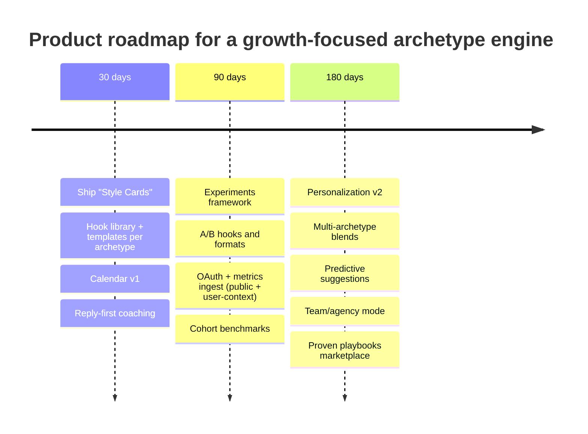

# Niche Archetypes and Writing Systems to Grow on X

## Executive summary

Growth on X is primarily a distribution-and-feedback problem: your posts must (a) earn new exposure beyond your followers and (b) generate the *types* of engagement the ranking system values most, all while avoiding behaviors that cause negative feedback. X’s own engineering write‑up describes a pipeline that pulls ~1,500 candidate posts per request, ranks them with a neural network, then applies heuristics/filters; the “For You” mix is roughly half in-network and half out-of-network on average. citeturn16view0

The open-sourced heavy-ranker configuration shows the ranking system strongly favors *conversational depth* over passive likes: reply probability is weighted far above like probability (13.5 vs 0.5), and “reply that the author engages with” is higher still (75). Negative feedback has a large penalty (-74) and reports are extremely penalized (-369). citeturn15view0

The practical implication for your app: your archetypes and writing styles should explicitly optimize for *reply generation + author reply behaviors* (and secondarily for profile clicks / relationship-building signals), while also discouraging “cheap engagement” patterns that trigger negative feedback. citeturn15view0turn16view0

From reviewing the connected repo (MVP), your product already points in the right direction: it (1) ingests recent posts, (2) computes baseline engagement, (3) classifies content/hook patterns, and (4) outputs a “creator profile” archetype + performance model summary, with an onboarding flow that chooses an optimization path. That structure is compatible with a scalable “archetype playbook” system; the biggest lift is making archetypes more operational (exact style specs + calendars + experiments) and grounding analytics in X’s official metrics APIs where feasible. citeturn5search1turn5search9

## Repo-driven product implications

The repo’s core design is a “fast onboarding → profile inference → performance model → recommended path” funnel. This is aligned with how X’s feed system actually works: rapid iteration is essential because ranking is driven by repeated cycles of candidate selection, scoring, and filtering. citeturn16view0

Two implementation implications matter for a growth app:

First, the “what to optimize” target should match what the platform optimizes. Because “reply” and “author engages with reply” have very high positive weights, a growth system should treat *reply rate* and *author reply rate* as first-class outcomes (not just likes). citeturn15view0

Second, analytics must be definable using accessible metrics. X’s developer documentation explicitly distinguishes public metrics (likes, reposts, replies, quotes) from non-public metrics (impressions, clicks), with non-public metrics available only in user context and only for posts created within the last 30 days. That constraint shapes what your app can measure “for everyone” vs “for logged-in users.” citeturn5search1turn5search9

## High-potential archetypes and niche signals

To make archetypes usable in-product (and compatible with the repo’s current shape), the best structure is:

1) **Archetype** = behavior + content contract (what you reliably deliver)  
2) **Niche overlay** = domain (AI, career, finance, fitness, design, policy, etc.)  
3) **Distribution loop** = the engagement pattern you intentionally drive (replies, quote-tweets, saves/bookmarks, profile clicks)  

This matches what X describes as a “rank then filter” system: your content gets a score, but downstream heuristics and negative feedback can still suppress you. citeturn16view0turn15view0

Below is a concise archetype set that maps cleanly to your MVP’s direction, while still covering the user-facing archetypes you listed (creator, curator, educator, entertainer, journalist, founder, community builder, niche expert). Each includes niche signals your app can detect in onboarding (bio/topic keywords, post patterns, and “offers”).

| Archetype (app-facing) | Why it’s high-potential on X | Audience signals your onboarding can detect | Typical “offer” that converts |
|---|---|---|---|
| **Builder** (niche expert who ships) | “Build-in-public” creates recurring conversational hooks (updates, decisions, tradeoffs), which encourages replies and follow-through. High compounding potential. citeturn15view0turn16view0 | Bio: “building”, “shipping”, “open source”, “SaaS”, “indie”, “dev”, “PM”; posts: changelogs, screenshots, “here’s what I learned” threads | Waitlist, product demo, OSS repo, “build notes” newsletter |
| **Founder / Operator** | Operators can produce decisive, polarized-but-constructive takes that trigger replies. Done well, it also drives profile clicks (people want context). citeturn15view0 | Bio: “founder”, “CEO”, “operator”, “growth”, “revenue”; posts: tactics, pricing, hiring, sales lessons | Case study, playbook, productized service, newsletter |
| **Educator** | Education content naturally fits “thread = mini-course” and drives structured replies (“Which one should I do?”). Threads also keep readers in the conversation context, aligning with “good click / stay” type signals in the heavy ranker model. citeturn15view0turn16view0 | Bio: “teacher”, “coach”, “explainer”, “how-to”; posts: numbered lists, frameworks, “how to” hooks | Course, coaching, templates, weekly “lesson” series |
| **Curator / Journalist** | Curation + synthesis works because it compresses attention: “here’s what matters” is broadly shareable and triggers quote-tweets and replies (“you missed X”). Works well with out-of-network distribution when framing is strong. citeturn16view0 | Bio: “writer”, “journalist”, “analyst”, “newsletter”; posts: digests, annotated quotes, neutral summaries + takeaways | Daily/weekly digest, resource vault, podcast/newsletter |
| **Social Operator** (community builder + entertainer modes) | High-reply formats (prompts, polls, “drop your…” posts) are directly rewarded by weighting schemes that favor replies and author reply engagement. Entertainment is a “fast hook” variant that can generate repeated responses. citeturn15view0 | Bio: “community”, “host”, “spaces”, “writer”; posts: prompts, memes w/ discussion hooks, Q&A, collaborations | Community membership, event series, collabs, referral loops |
| **Job Seeker / Career Operator** | Career content wins when it’s *useful + empathetic* and invites responses (resume critiques, interview questions, hiring manager prompts). Reply-driven distribution is very compatible with ranker weights. citeturn15view0 | Bio: “open to work”, “hiring”, “recruiter”, “career”; posts: checklists, templates, “DM me your…” prompts | Job lead magnet, resume template, coaching, job board |

## Writing styles and templates by archetype

The style specs below are written as *executable constraints* your app can store as a “Style Card” and apply in a composer, thread builder, and content calendar. They’re intentionally concrete: tone, length, hooks, structure, CTA rules, and cadence.

A key global rule, grounded in the open heavy-ranker configuration: prioritize conversation and avoid tactics that create negative feedback (mutes/blocks/reports), because the penalties are large. citeturn15view0

### Builder

**Tone:** candid, technical-but-readable, “I’m learning in public.”  
**Sentence length:** 7–16 words; occasional 3–6 word “punch lines.”  
**Hook types:** changelog (“Shipped X”), decision point (“I removed feature Y”), constraint (“We had 2 days”).  
**Thread structure:** Hook → context → 3–7 “build steps” → outcome metric → question.  
**Templates (single post):**  
- “Shipped: [feature]. What I’d do differently: [1 thing].”  
- “If you’re building [X], don’t do [common mistake]. Do [alternative].”  
- “I tested [A vs B]. Result: [X]. Here’s the setup.”  
**Hashtags + CTA:** 0–1 hashtag max; CTA is *one* action (waitlist / feedback request). Avoid “spammy” multi-CTA.  
**Emoji policy:** none or 1 functional emoji (✅, ⚠️).  
**Cadence:** 1–2 posts/day + 10–20 high-quality replies/day (replying is structurally valuable). citeturn15view0

**Sample posts (5):**  
1) “Shipped a ‘hook library’ into our X growth app: 42 proven openings, ranked by your past reply rate. Next: auto‑A/B testing.”  
2) “I removed 3 onboarding questions and activation went up. The lesson: don’t ask users to ‘self-diagnose’ before you’ve shown value.”  
3) “If you’re building a creator tool: track replies separately from likes. It changes what you recommend.”  
4) “Built a ‘thread skeleton’ generator: hook → proof → steps → question. It’s amazing how much easier consistency gets.”  
5) “What’s the one metric you wish your social tool predicted before you hit ‘post’?”

### Founder / Operator

**Tone:** decisive, pragmatic, slightly contrarian (but not hostile).  
**Sentence length:** 6–14 words; avoid long clauses.  
**Hook types:** contrarian rule (“Stop doing X”), numbers (“3 hiring mistakes”), “here’s what worked.”  
**Thread structure:** Hook → “why most fail” → playbook (5–9 bullets) → closing question.  
**Templates:**  
- “Revenue is not your problem. [constraint] is.”  
- “Operator take: [rule]. Here’s the mechanism.”  
- “I’d rather [tradeoff] than [status symbol].”  
**Hashtags + CTA:** 0 hashtags; CTA asks for a counterexample or story (drives replies).  
**Emoji policy:** none or 1 (📌).  
**Cadence:** 1–3 posts/day; 2 “reply blocks” (15 minutes) after posting to respond to early replies. citeturn15view0

**Sample posts (5):**  
1) “Most founders don’t need a new strategy. They need a posting system: 3 formats, 12 hooks, 4 weeks. Then iterate.”  
2) “If you want distribution, write posts that *invite* disagreement without insulting people.”  
3) “We’re building an ‘operator mode’ for X: it turns your best post into 5 variations and schedules them across 14 days.”  
4) “Stop asking ‘How do I go viral?’ Start asking: ‘What conversation can I lead weekly for a year?’”  
5) “What would you pay for: better hooks, better calendars, or better analytics?”

### Educator

**Tone:** generous, structured, “teacher voice.”  
**Sentence length:** 8–18 words; allow slightly longer explanatory sentences in threads.  
**Hook types:** “How to…”, numbered mini-course, myth-busting, checklist.  
**Thread structure:** Hook → promise → steps (7–12) → recap → “Which step is hardest?”  
**Templates:**  
- “How to [result] in [timeframe] (without [common trap]).”  
- “The [X] framework (steal this): 1)… 2)… 3)….”  
- “If you only remember one thing about [topic], remember this: [rule].”  
**Hashtags + CTA:** 0–2 hashtags *only if niche-specific*; CTA is a question or “reply with your situation.”  
**Emoji policy:** consistent functional markers (e.g., “→”, “•”, “(1)”).  
**Cadence:** 3–5 threads/week + 1–2 single posts/day; reply to the first 30–60 minutes of comments (author engagement matters). citeturn15view0

**Sample posts (5):**  
1) “How to grow on X in 30 days (without spamming): 1) Pick one audience, 2) Ship 3 repeatable formats, 3) Ask better questions.”  
2) “Framework: HOOK → PROOF → STEPS → QUESTION. If your post lacks one, fix it before posting.”  
3) “A/B test idea: keep the content identical, change only the first line. Track replies, not likes.”  
4) “Your ‘content calendar’ should be a *machine*: inputs (ideas) → formats → posts → metrics → adjustments.”  
5) “Reply with your niche + what you sell, and I’ll suggest 3 weekly content pillars.”

### Curator / Journalist

**Tone:** neutral-first, precise, attribution-minded; add a *measured* “so what.”  
**Sentence length:** 10–20 words; clarity > brevity.  
**Hook types:** “What happened”, “3 takeaways”, “If you missed it”, “Here’s the context.”  
**Thread structure:** Headline → key facts → implications → 3 links/quotes → question.  
**Templates:**  
- “If you missed [topic], here are 3 things that matter.”  
- “The consensus says [X]. The evidence says [Y].”  
- “Here’s a 60‑second brief on [topic].”  
**Hashtags + CTA:** usually none; ask “what did I miss?” or “what’s your read?” (reply driver).  
**Emoji policy:** none or minimal (🧵).  
**Cadence:** 1 digest/day + 1 deeper thread/week; consistent “same time” publishing builds habitual readership. citeturn16view0

**Sample posts (5):**  
1) “Daily brief: 3 platform changes creators should care about + what to test this week.”  
2) “If you want to understand why replies matter on X, look at the ranking weights: conversation depth dominates.” citeturn15view0  
3) “I’m collecting the best growth experiments from small accounts (under 5k). Reply with yours and outcome.”  
4) “The most underrated growth asset is a pinned post that explains your ‘why follow.’ Most people don’t have one.”  
5) “Thread: what I learned from 10 creator audits (patterns repeat more than you think).”

### Social operator

**Tone:** warm, playful, high-energy; “I’m hosting.”  
**Sentence length:** 4–14 words; keep scan-friendly.  
**Hook types:** prompts, polls, “drop your…”, challenges, “hot seat” Q&A.  
**Thread structure:** Prompt → 3 example answers → invite submissions → reply to replies.  
**Templates:**  
- “Hot take: [statement]. Convince me otherwise.”  
- “Drop your [X]. I’ll reply with [Y].”  
- “One thing you believe that most people don’t?”  
**Hashtags + CTA:** avoid hashtags; CTA is an invitation to reply (the whole point).  
**Emoji policy:** allowed; keep consistent; avoid clutter.  
**Cadence:** 2–4 prompts/week + daily replies; plan “comment windows” because author reply engagement is highly valued. citeturn15view0

**Sample posts (5):**  
1) “Drop your bio. I’ll rewrite it in 15 words (and tell you what archetype it signals).”  
2) “What’s the most addictive part of X growth? The feedback loop. What’s yours?”  
3) “I’m building a ‘reply coach’ into our app. Give me your last tweet—what reply were you *hoping* for?”  
4) “Poll: Which helps more? A) better hooks B) better consistency C) better replies.”  
5) “Challenge: reply to 20 people in your niche today. Report back what happened.”

### Job seeker

**Tone:** supportive, specific, non-snarky; “here’s how to win without burning out.”  
**Sentence length:** 8–18 words; short checklists work best.  
**Hook types:** “13 mistakes”, “resume line rewrite”, “interview question breakdown”, “hiring manager POV.”  
**Thread structure:** Pain → checklist → example rewrite → invite replies with context.  
**Templates:**  
- “If you’re interviewing for [role], prepare these 5 stories.”  
- “Rewrite this resume bullet: [before] → [after].”  
- “Hiring managers don’t want [X]. They want [Y].”  
**Hashtags + CTA:** 0–1 hashtag (e.g., #hiring) if you’re actually hiring; CTA is “reply with your role + goal.”  
**Emoji policy:** minimal, functional (✅ / ❌).  
**Cadence:** 3–5 posts/week + “reply clinics” (batch reply sessions). Reply depth aligns with conversation-weighted ranking. citeturn15view0

**Sample posts (5):**  
1) “If you’re job hunting: stop ‘networking.’ Start leaving thoughtful replies where hiring managers hang out.”  
2) “Resume rule: one line = one outcome. If you can’t measure it, show the decision you influenced.”  
3) “I’m building a ‘career mode’ for our X app: it turns your experience into 10 proof-first tweets.”  
4) “Interview prep: write 3 stories where you fixed a messy situation. That’s what gets remembered.”  
5) “Reply with your target role and I’ll suggest 3 content pillars that attract that audience.”

## App-specific recommendations to improve results

Your MVP already has the skeleton for an “archetype engine.” The next step is to make outputs *actionable the same day*: posts, calendars, experiments, and measurable goals.

### Onboarding copy and flow

Because X scoring heavily rewards conversation signals, onboarding should strongly steer users toward “reply-first” behaviors (and away from spammy volume). citeturn15view0

**Recommended onboarding steps (copy-ready):**

1) **Goal selection (single choice + optional secondary):**  
   - Primary: “Get more followers”, “Sell an offer”, “Build authority”, “Find a job”, “Grow a community”  
   - Secondary: “More replies”, “More profile visits”, “More newsletter signups”

2) **Time budget (explicit):**  
   - “I can post: 3×/week / 1×day / 2×day”  
   - “I can reply: 0–5 / 5–15 / 15–30 per day” (this is the highest-leverage toggle per ranker weights). citeturn15view0

3) **Voice slider (two axes):**  
   - “Direct ↔ Gentle”  
   - “Playful ↔ Formal”  
   Store this as a reusable “Style Card.”

4) **Archetype recommendation (with confidence + override):**  
   - Show: “You’re closest to: Builder (72%). Also fits: Educator (18%).”

5) **Instant output (within 60 seconds):**  
   - “Your next 7 posts” + “Your reply routine for the next 3 days” + 2 A/B tests.

### Bio examples and pinned post templates

Keep bios and pins aligned with the platform reality: your profile is a conversion page, and “profile click” is explicitly modeled as a meaningful engagement signal in the ranking system. citeturn15view0turn5search9

**Bio templates (fill‑in):**
- “I help [audience] achieve [outcome] with [method]. Building [thing].”
- “[Role]. Writing about [topic] + [topic]. New posts: [cadence].”
- “Hiring / Open to work: [role]. Proof: [metric]. Portfolio: [thing].”

**Pinned post templates (3):**
1) **Promise + proof + path**  
   “If you like [topic], follow me. I post [cadence]. Start here: [3 best posts].”
2) **Lead magnet (soft)**  
   “I made a free [checklist/template]. Reply ‘X’ and I’ll send it.”
3) **Build-in-public**  
   “What I’m building + weekly progress + what I learned (thread).”

### Content calendar system

Your app should generate calendars as a *repeatable machine*, not a one-off plan. X’s own description emphasizes a fast, repeated ranking process; consistency matters because you need many “shots” at the candidate→rank→filter loop. citeturn16view0

A practical default for most users:
- **3 “pillar” posts/week** (teaching / building / opinion)  
- **2 conversation prompts/week** (reply drivers)  
- **Daily reply target** that matches time budget (5–30 replies)

### A/B tests, KPIs, and growth experiments

Because X offers standardized public metrics (likes, reposts, replies, quotes), you can compute consistent KPIs for all users; for advanced users, add “non-public metrics” (impressions, clicks) where authentication allows, noting the 30‑day window limitation. citeturn5search1turn5search9

**Core KPIs (minimum viable analytics):**
- Replies per post; replies per impression (when available) citeturn5search1turn5search9  
- Engagement Rate by followers (ERF) benchmarked by follower size (use size brackets) citeturn2search2  
- “Conversation conversion”: % of posts where the author replies to a reply (behavioral) citeturn15view0  
- “Format win rate”: best hook type and best post length band (single vs thread)

**High-value experiments (copy-ready):**
- Hook-only A/B: same body, 2 different first lines (measure replies)  
- “Reply clinic”: post an invite + spend 25 minutes replying fast (measure sustained thread depth) citeturn15view0  
- “Series”: 5 posts with the same format + title prefix (measure follower conversion)

## Competitive analysis on X

Metrics below are taken from entity["company","Favikon","creator analytics platform"] profiles/articles (as crawled) and represent snapshots, not guaranteed real-time values. Engagement Rate (ER) should be interpreted relative to follower size; Favikon publishes follower-size benchmarks and discusses quartiles. citeturn2search2turn3search4

### Builder archetype benchmarks

| Account | Followers | Engagement rate | Post frequency | Top-performing post types | Source |
|---|---:|---:|---:|---|---|
| entity["people","Sahil Lavingia","gumroad founder"] (@shl) | 361.9K | 0.29% | 9 tweets/week | build-in-public reflections, product philosophy | citeturn23search0 |
| entity["people","Pieter Levels","indie maker"] (@levelsio) | 563.6K | 0.24% | 60.1 tweets/week | shipping updates, transparency threads | citeturn23search1 |
| entity["people","Arvid Kahl","indie saas author"] (@arvidkahl) | 166.1K | 0.06% | 9.9 tweets/week | SaaS building threads, lessons learned | citeturn30search6 |
| entity["people","Hussein Nasser","software engineer educator"] (@hnasr) | 78.6K | 0.34% | 6.1 tweets/week | backend performance takes, engineer takeaways | citeturn31search9 |
| entity["people","Balaji Srinivasan","tech entrepreneur"] (@balajis) | 1.1M | 0.43% | 15.6 tweets/week | tech strategy threads, contrarian analysis | citeturn28search8 |
| entity["people","Linas Beliūnas","tech finance commentator"] (@linasbeliunas) | 7.1K | 0.16% | 7.7 tweets/week | quick takes on tech/finance news | citeturn29search2 |

### Founder/operator archetype benchmarks

| Account | Followers | Engagement rate | Post frequency | Top-performing post types | Source |
|---|---:|---:|---:|---|---|
| entity["people","Alex Hormozi","business entrepreneur"] (@alexhormozi) | 716K | 0.64% | 15.6 tweets/week | short business rules, punchy advice | citeturn25search3 |
| entity["people","Paul Graham","y combinator cofounder"] (@paulg) | 1.9M | 0.22% | 11 tweets/week | startup principles, reflective one-liners | citeturn25search1 |
| entity["people","Dan Martell","saas founder"] (@danmartell) | 76.7K | 0.24% | 16.4 tweets/week | bite-sized wisdom, relatable founder lessons | citeturn25search2 |
| entity["people","Ali Ghodsi","databricks ceo"] (@alighodsi) | 15.1K | 2.74% | 1 tweet/week | milestone announcements, timed amplification | citeturn20search1 |
| entity["people","Raoul Pal","macro investor"] (@raoulgmi) | 1.1M | 0.23% | 23.6 tweets/week | macro charts, crypto commentary | citeturn28search5 |
| entity["people","Ray Dalio","bridgewater founder"] (@raydalio) | 1.5M | 0.05% | 9.8 tweets/week | market commentary, generational advice | citeturn28search2 |

### Educator archetype benchmarks

| Account | Followers | Engagement rate | Post frequency | Top-performing post types | Source |
|---|---:|---:|---:|---|---|
| entity["people","Sahil Bloom","investor and writer"] (@sahilbloom) | 1.1M | 0.34% | 12 tweets/week | numbered threads, mini-courses | citeturn26search1 |
| entity["people","James Clear","author atomic habits"] (@jamesclear) | 1.1M | 0.31% | 2.7 tweets/week | standalone principles, quotable reminders | citeturn20search0 |
| entity["people","Dan Koe","creator educator"] (@thedankoe) | 478.8K | 0.6% | 15.1 tweets/week | thought-provoking threads, productivity lessons | citeturn29search3 |
| entity["people","Dan Go","fitness coach for founders"] (@fitfounder) | 756.4K | 0.26% | 29.5 tweets/week | punchy micro-lessons, contrast threads | citeturn29search4 |
| entity["people","Ben Meer","systems newsletter creator"] (@systemsunday) | 373.5K | 0.46% | 1.5 tweets/week | evergreen systems statements, checklists | citeturn30search2 |
| entity["people","Ryan Holiday","author daily stoic"] (@ryanholiday) | 745.6K | 0.21% | 23.1 tweets/week | short Stoic principles, consistent cadence | citeturn27search0 |

### Curator archetype benchmarks

| Account | Followers | Engagement rate | Post frequency | Top-performing post types | Source |
|---|---:|---:|---:|---|---|
| entity["people","Tim Ferriss","author podcaster"] (@tferriss) | 2M | 0.05% | 11.6 tweets/week | quoting guests, evergreen frameworks | citeturn24search3 |
| entity["people","Lenny Rachitsky","product podcast host"] (@lennysan) | 221.4K | 0.1% | 11 tweets/week | bite-size insights, podcast amplification | citeturn21search1 |
| entity["people","David Perell","writing educator"] (@david_perell) | 447.8K | 0.1% | 3.1 tweets/week | threads that distill writing + creativity ideas | citeturn27search1 |
| entity["people","Natalie Amiri","journalist correspondent"] (@natalieamiri) | 145.8K | 0.08% | 4.3 tweets/week | breaking-news framing + links, issue updates | citeturn24search0 |
| entity["people","Genevieve Roch-Decter","financial media creator"] (@grdecter) | 432.7K | 0.14% | 10.6 tweets/week | real-time updates + commentary | citeturn28search7 |
| entity["people","Adam Faze","media producer"] (@adamfaze) | 3.3K | 0.38% | 6.5 tweets/week | quick commentary on media/politics | citeturn19search1 |

### Social operator archetype benchmarks

| Account | Followers | Engagement rate | Post frequency | Top-performing post types | Source |
|---|---:|---:|---:|---|---|
| entity["people","Jschlatt","content creator"] (@jschlatt) | 3.1M | 7.56% | 2.4 tweets/week | witty one-liners, viral humor | citeturn19search0 |
| entity["people","Sukihana","rapper and influencer"] (@sukihanagoat) | 1.1M | 0.35% | 13.6 tweets/week | candid banter, trend reactions | citeturn24search1 |
| entity["people","Sapnap","gaming creator"] (@Sapnap) | 3.3M | 0.78% | 0.8 tweets/week | announcements + fan interaction | citeturn26search0 |
| entity["people","Daniel Middleton","youtuber dantdm"] (@dantdm) | 2.3M | 3.47% | 0.4 tweets/week | humor + commentary, legacy fan base | citeturn26search4 |
| entity["people","Spreen","streamer"] (@spreendmc) | 6.2M | 0.16% | 3.6 tweets/week | memes + playful takes | citeturn22search6 |
| entity["people","Justin Flom","video creator"] (@justinflom) | 20.9K | 209.64% | 0.9 tweets/week | selective viral video drops | citeturn20search3 |

### Job seeker archetype benchmarks

| Account | Followers | Engagement rate | Post frequency | Top-performing post types | Source |
|---|---:|---:|---:|---|---|
| entity["people","George Stern","career coach"] | 29K | 3.89% | 4 tweets/week | problem→solution posts, visual guides | citeturn30search0 |
| entity["people","Ben Meer","systems newsletter creator"] (@systemsunday) | 373.5K | 0.46% | 1.5 tweets/week | productivity checklists, evergreen advice | citeturn30search2 |
| entity["people","Morgan J Ingram","sales educator"] | 26.4K | 0.06% | 6.1 tweets/week | short sales tips, real-time tactics | citeturn31search2 |
| entity["people","Neal Mohan","youtube ceo"] | 60.3K | 0.12% | 4.4 tweets/week | policy/feature updates, stakeholder targeting | citeturn31search4 |
| entity["people","Sultan Ahmed Bin Sulayem","dp world ceo"] | 16.7K | 0.05% | 3.4 tweets/week | leadership updates, industry milestones | citeturn31search1 |
| entity["people","Rahul Mathur","finance entrepreneur"] | 91.7K | 0.22% | 15 tweets/week | bite-sized finance wisdom + mentorship tone | citeturn29search1 |

## Implementation plan and prioritized roadmap

Your repo suggests an MVP capable of producing (a) archetype classification and (b) performance insights from recent posts. The roadmap below makes that system commercially useful by turning “insights” into “actions” plus measurement loops using X metrics APIs. citeturn5search1turn5search9

**30-day milestones (measurable):**
- “Style Card” system in-app: each archetype has hard constraints (tone/length/hooks/thread skeletons).  
- Calendar v1 auto-generates 14 days of posts + daily reply targets (time-budget aware).  
- KPI baseline: replies/post, ERF, and per-format win rates using public metrics. citeturn5search1turn5search9  
- Target: ≥30% of onboarded users generate a calendar and export/save ≥7 posts.

**90-day milestones (measurable):**
- Experiments engine: hook A/B and format A/B with automatic “winner” selection.  
- OAuth option to access non-public metrics (impressions/clicks) for recent posts where available; clearly label the 30‑day constraint. citeturn5search1turn5search9  
- Cohort benchmarks by archetype and follower size (ER expectations differ by size). citeturn2search2  
- Target: ≥25% of active users run ≥1 experiment/week for 4 weeks; measurable lift in replies/post for a plurality of users.

**180-day milestones (measurable):**
- Personalization v2: archetype blends (e.g., Builder×Educator) and “niche overlays” (AI, finance, career, health).  
- Predictive suggestion loop: “recommended next post” based on what produced replies for similar accounts.  
- Target: demonstrated retention lift (e.g., +15–25% in 8-week retention for users who adopt calendars + reply routines).

## Sources and evidence base

Primary and official sources were prioritized for “how X works” and “what can be measured.”

- X Engineering: recommendation pipeline overview, ~1,500 candidates, ranking + heuristics, in-network/out-of-network mix. citeturn16view0  
- Open heavy-ranker reference weights (reply-centric weighting + negative penalties), including the “weighted sum of engagement probabilities” framing. citeturn15view0  
- X Developer docs: public vs non-public metrics, available public metric fields, and the 30-day limit for certain non-public metrics. citeturn5search1turn5search9  
- Engagement benchmarking guidance and size brackets (useful for app comparisons). citeturn2search2turn3search4  
- Competitive account snapshots and posting habit patterns from Favikon profile analyses used in the benchmark tables. citeturn23search0turn23search1turn30search6turn31search9turn28search8turn29search2turn25search3turn25search1turn25search2turn20search1turn28search5turn28search2turn26search1turn20search0turn29search3turn29search4turn30search2turn27search0turn24search3turn21search1turn27search1turn24search0turn28search7turn19search1turn19search0turn24search1turn26search0turn26search4turn22search6turn20search3turn30search0turn31search2turn31search4turn31search1turn29search1